# 📡 Diagramas de Comunicación - API-Factus

Este documento contiene los diagramas de comunicación que muestran la interacción y el flujo de mensajes entre los objetos del sistema de facturación API-Factus.

---

## 📝 Tabla de Contenidos

1. [Introducción](#introducción)
2. [Autenticación](#autenticación)
3. [Gestión de Empresas](#gestión-de-empresas)
4. [Gestión de Clientes](#gestión-de-clientes)
5. [Gestión de Facturas](#gestión-de-facturas)
6. [Gestión de Pagos](#gestión-de-pagos)
7. [Flujos Complejos](#flujos-complejos)

---

## 📖 Introducción

Los diagramas de comunicación (anteriormente conocidos como diagramas de colaboración) muestran las interacciones entre objetos o partes en términos de mensajes secuenciados. Se enfocan en la organización estructural de los objetos que envían y reciben mensajes.

**Notación:**
- Los números indican el orden de los mensajes (1, 2, 3, etc.)
- Los números anidados indican submensajes (1.1, 1.2, 2.1, etc.)
- Las flechas muestran la dirección del mensaje
- Los objetos se representan como nodos

---

## 🔐 Autenticación

### Registro de Usuario

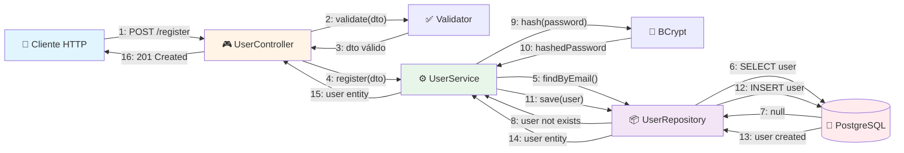

---

### Inicio de Sesión

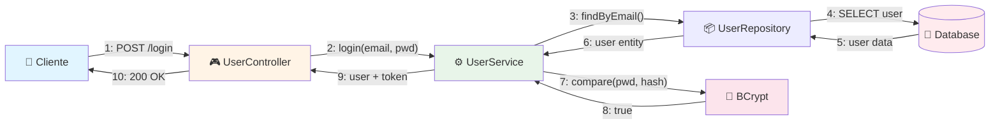

---

## 🏢 Gestión de Empresas

### Crear Empresa

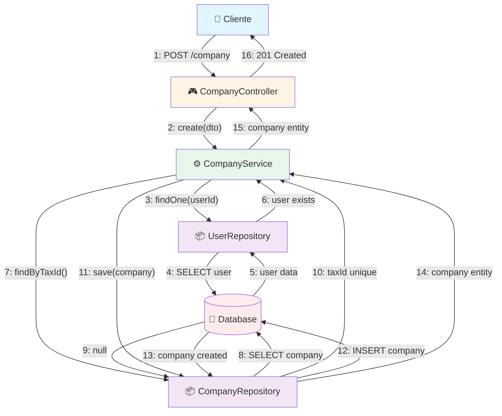

---

### Actualizar Empresa

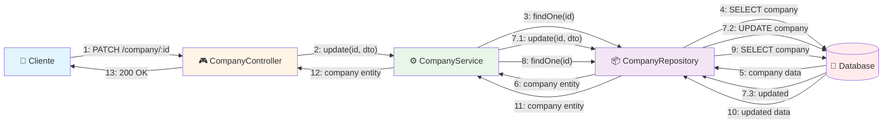

---

## 👥 Gestión de Clientes

### Crear Cliente

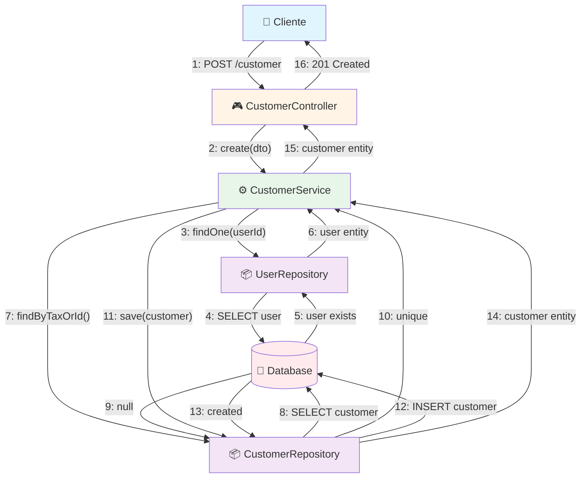

---

### Búsqueda de Clientes con Filtros

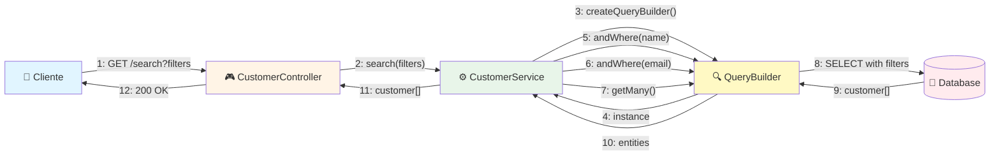

---

## 📄 Gestión de Facturas

### Crear Factura Completa

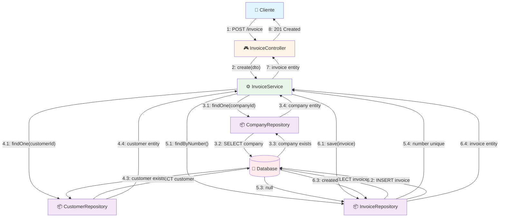

---

### Agregar Detalle a Factura

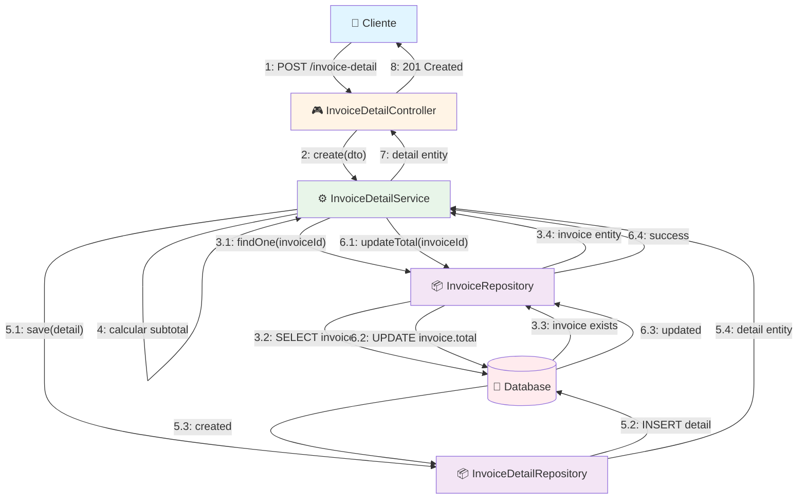

---

### Cambiar Estado de Factura

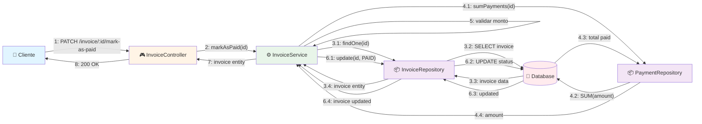

---

## 💰 Gestión de Pagos

### Registrar Pago

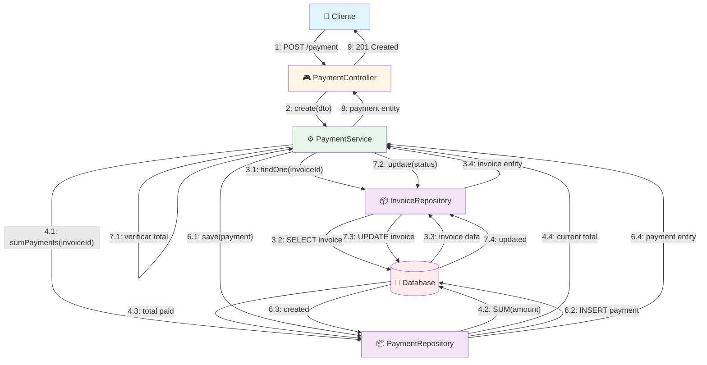

---

### Consultar Pagos de Factura

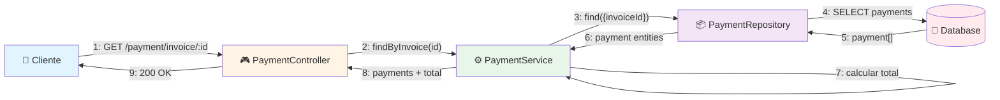

---

## 🔄 Flujos Complejos

### Ciclo Completo: Crear Factura con Detalles y Pago

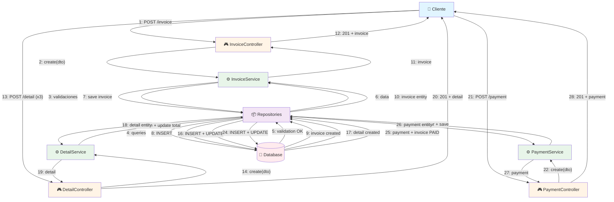

---

### Consulta de Estadísticas

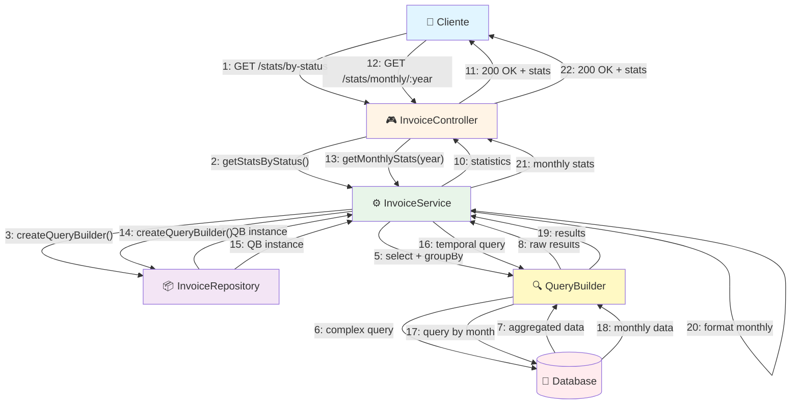

---

### Búsqueda Avanzada con Múltiples Filtros

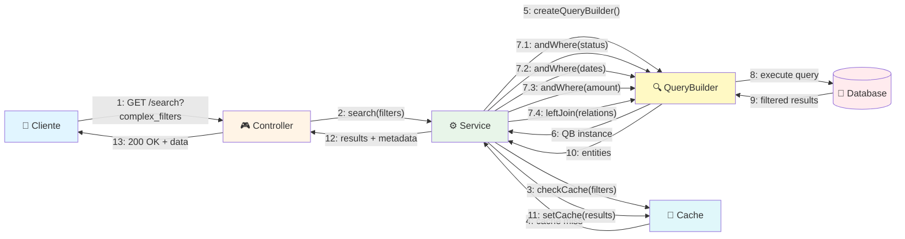

---

### Eliminación Segura con Referencias NULL

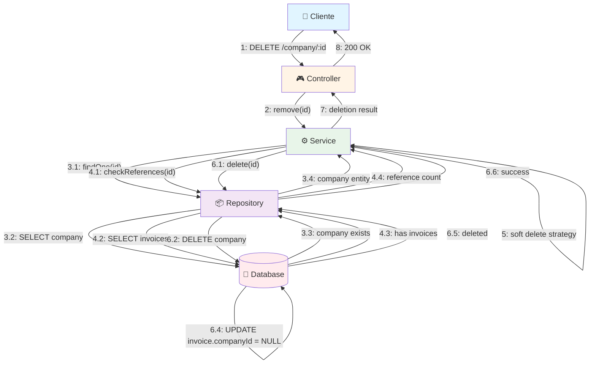

---

## 🔄 Comunicación entre Módulos

### Interacción Multi-Módulo: Invoice → Company + Customer

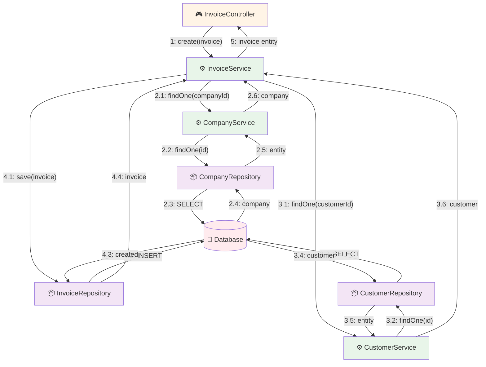

---

### Patrón Repository: Abstracción de Acceso a Datos

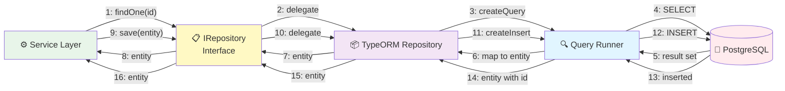

---

## 📊 Convenciones de los Diagramas

### Numeración de Mensajes
- **Secuencial:** 1, 2, 3, 4...
- **Anidado:** 1.1, 1.2, 2.1, 2.2...
- **Condicional:** 1a, 1b (alternativas)
- **Iterativo:** 1*, 2* (repetición)

### Tipos de Comunicación
- **Síncrona:** Flecha sólida (→)
- **Asíncrona:** Flecha discontinua (⇢)
- **Retorno:** Flecha punteada (⤺)

### Iconos de Componentes
- 📱 Cliente HTTP
- 🎮 Controllers
- ⚙️ Services
- 📦 Repositories
- 🔍 Query Builders
- 💾 Base de Datos
- 🔐 Seguridad (BCrypt)
- ✅ Validadores
- 💨 Cache

### Código de Colores
- **Azul claro:** Cliente
- **Naranja claro:** Controllers
- **Verde claro:** Services
- **Púrpura claro:** Repositories
- **Rojo claro:** Base de Datos
- **Amarillo:** Query Builders

---

## 🎯 Patrones de Comunicación Identificados

### 1. Patrón Layered (Capas)
```
Cliente → Controller → Service → Repository → Database
```

### 2. Patrón Repository
```
Service → IRepository (interface) → ConcreteRepository → Database
```

### 3. Patrón Query Builder
```
Service → QueryBuilder → Database
```

### 4. Patrón de Validación
```
Controller → Validator → Service (si válido)
```

### 5. Patrón de Transacción
```
Service → Repository.beginTransaction()
Service → Repository.save()
Service → Repository.commit() | rollback()
```

---

## 🔍 Cómo Visualizar estos Diagramas

### Opción 1: GitHub / GitLab
Los diagramas Mermaid se renderizan automáticamente.

### Opción 2: VS Code
Instala la extensión **Markdown Preview Mermaid Support**:
```bash
code --install-extension bierner.markdown-mermaid
```

### Opción 3: Mermaid Live Editor
Visita: https://mermaid.live/

### Opción 4: Herramientas de Documentación
- MkDocs con plugin mermaid2
- Docusaurus con soporte Mermaid
- GitBook con soporte Mermaid

---

## 📚 Referencias

- **UML Communication Diagrams:** Muestra la interacción estructural entre objetos
- **Message Numbering:** Indica el orden temporal de los mensajes
- **Collaboration:** Enfoque en la organización de objetos que colaboran
- **Pattern Recognition:** Identificación de patrones arquitectónicos

---

**Generado:** 5 de Noviembre, 2025  
**Proyecto:** API-Factus  
**Versión:** 1.0.0  
**Arquitectura:** NestJS + TypeORM + PostgreSQL
