# 📊 Diagramas del Sistema API-Factus

Este documento contiene los diagramas de arquitectura del sistema de facturación API-Factus.

---

## 📦 Diagrama de Componentes del Sistema

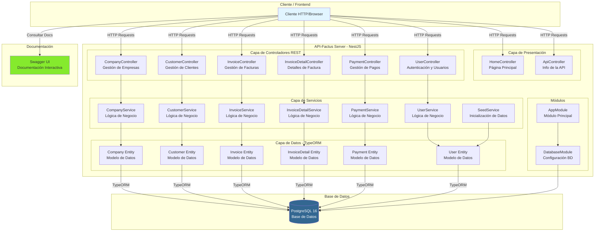

---

## 🗂️ Diagrama de Módulos de NestJS

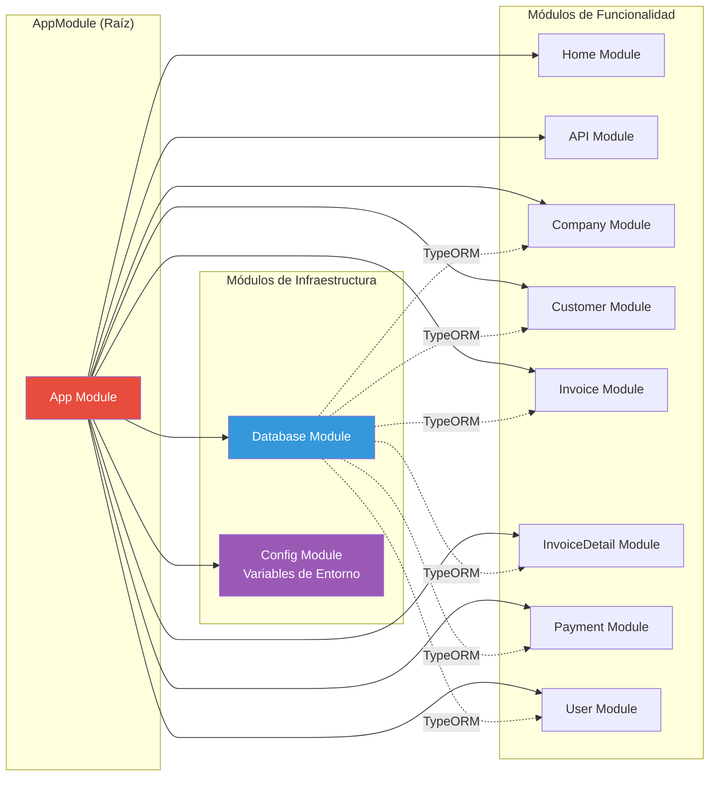

---

## 🔄 Diagrama de Relaciones entre Entidades

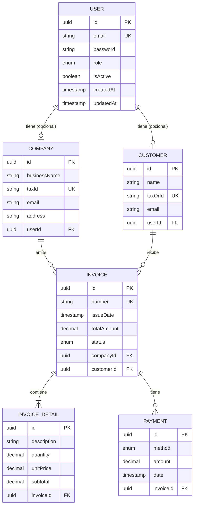

---

## 🏗️ Arquitectura en Capas

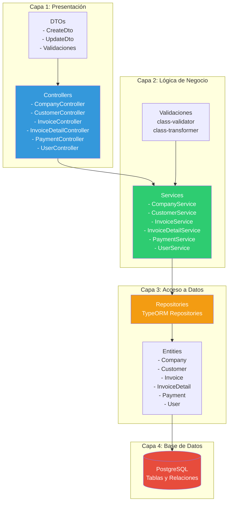

---

## 🔀 Flujo de Datos: Crear Factura

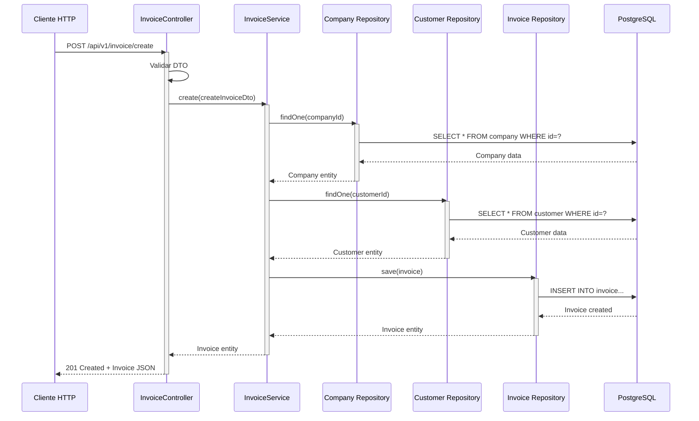

---

## 🔐 Flujo de Autenticación

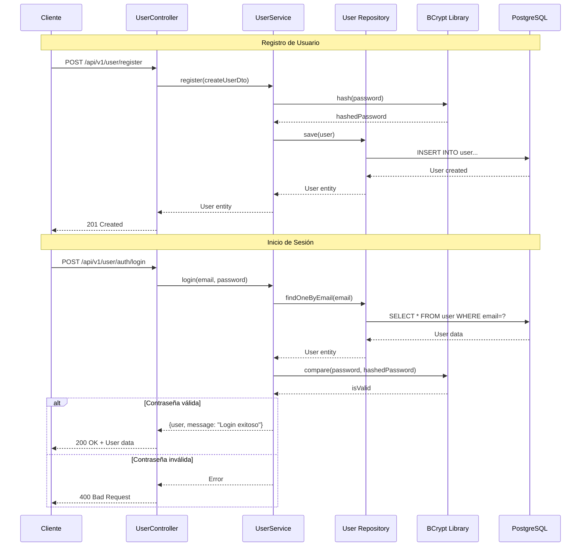

---

## 📊 Diagrama de Estados de Factura

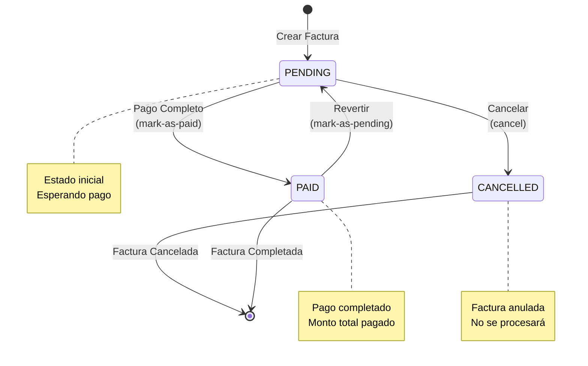

---

## 🔧 Componentes Técnicos

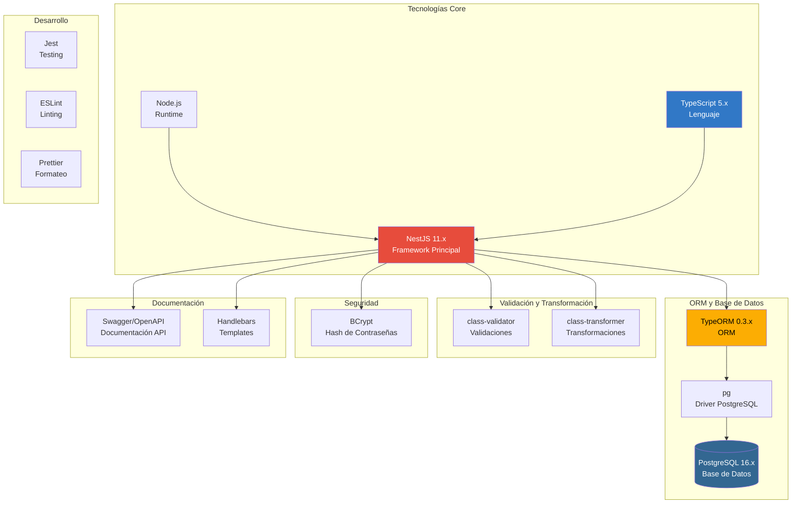

---

## 📁 Estructura de Directorios

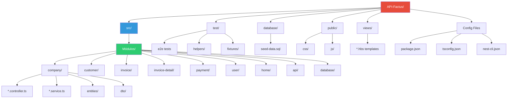

---

## 🌐 Flujo Completo: Ciclo de Vida de una Factura

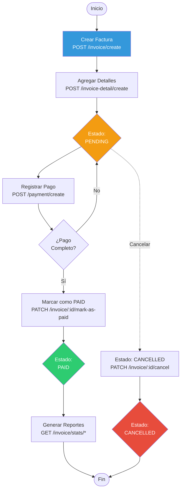

---

## 📈 Casos de Uso Principales

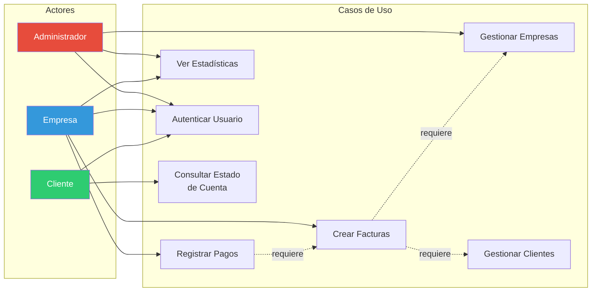

---

## 🔍 Cómo Visualizar estos Diagramas

### Opción 1: GitHub / GitLab
Los diagramas Mermaid se renderizan automáticamente cuando ves este archivo en GitHub o GitLab.

### Opción 2: VS Code
Instala la extensión **Markdown Preview Mermaid Support**:
```bash
code --install-extension bierner.markdown-mermaid
```

### Opción 3: Mermaid Live Editor
Copia el código Mermaid y pégalo en: https://mermaid.live/

### Opción 4: Documentación Markdown
Muchos generadores de documentación (MkDocs, Docusaurus, etc.) soportan Mermaid nativamente.

---

**Generado:** 4 de Noviembre, 2025  
**Proyecto:** API-Factus  
**Versión:** 1.0.0
