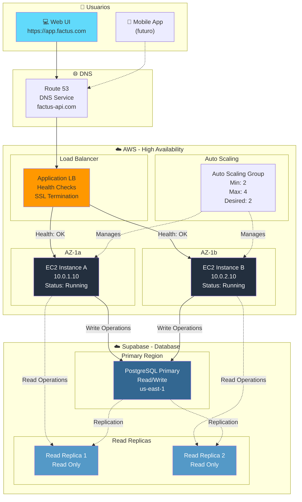
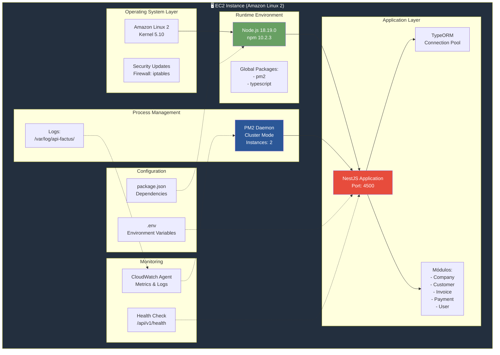
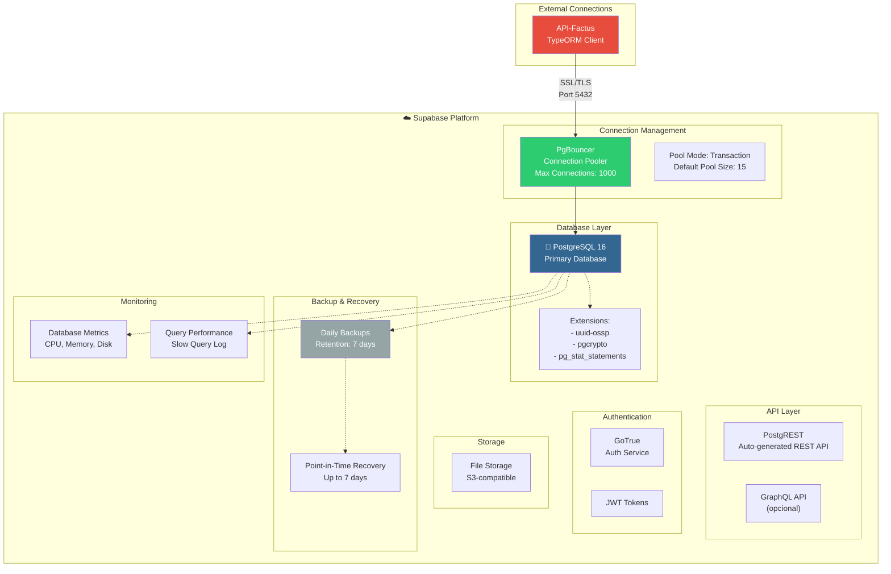
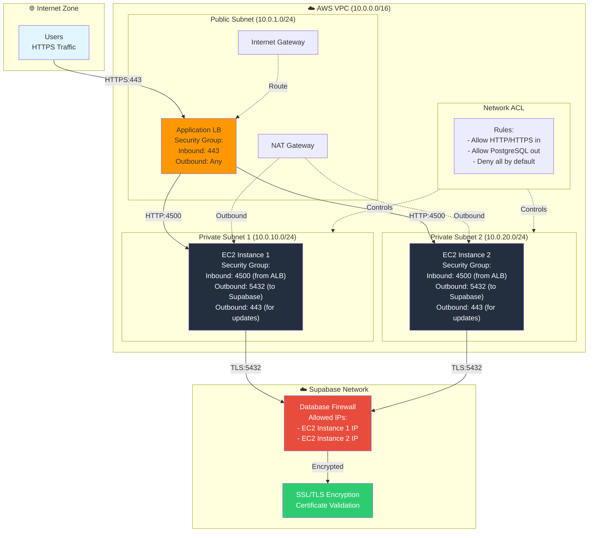
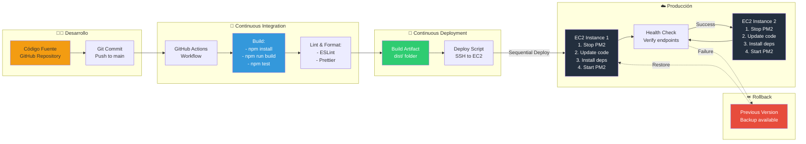
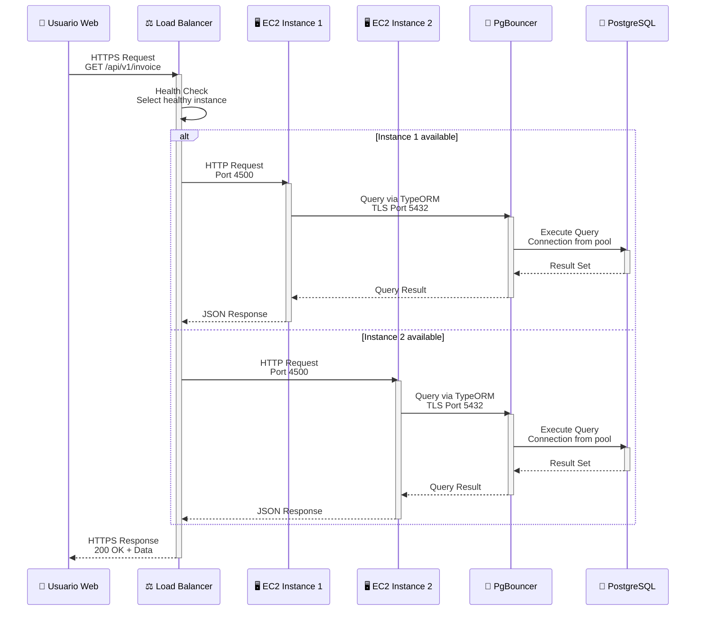
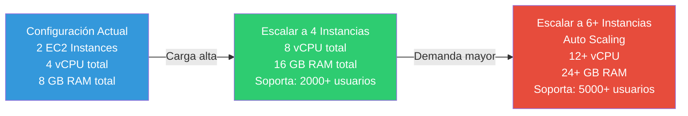
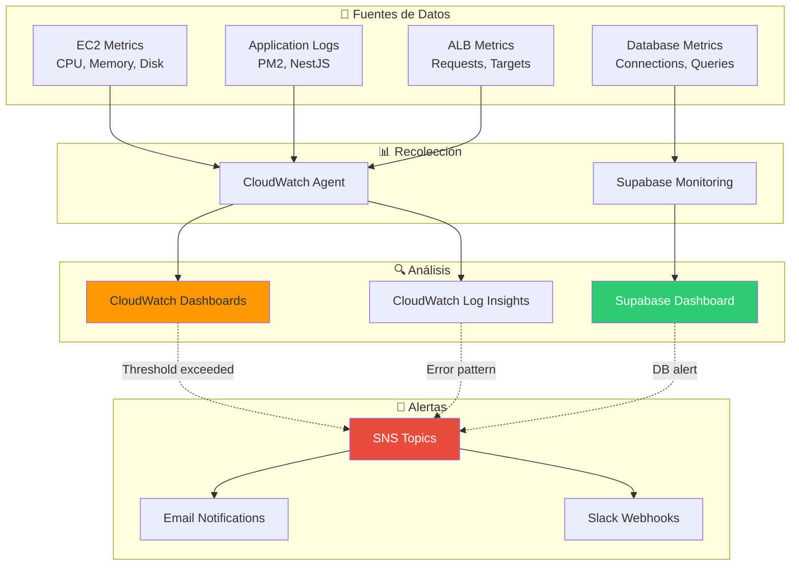

# 🚀 Diagrama de Despliegue - API-Factus

Este documento contiene el diagrama de despliegue que muestra la arquitectura física del sistema de facturación API-Factus, incluyendo servidores, servicios cloud y componentes de infraestructura.

---

## 📋 Información de Despliegue

### Infraestructura Cloud
- **Servidor de Aplicación:** 2x AWS EC2 (Alta Disponibilidad)
- **Base de Datos:** PostgreSQL en Supabase
- **Cliente:** UI Web Externa (Frontend)

### Tecnologías
- **Backend:** NestJS + TypeScript
- **ORM:** TypeORM
- **Runtime:** Node.js 18+
- **Database:** PostgreSQL 16
- **Cloud Provider:** AWS + Supabase

---

## 🌐 Diagrama de Despliegue Principal

```mermaid
graph TB
    subgraph INTERNET["🌐 Internet"]
        CLIENT["💻 UI Web Externa<br/>React/Vue/Angular<br/>Browser"]
    end
    
    subgraph AWS["☁️ AWS Cloud"]
        subgraph LOAD_BALANCER["⚖️ Load Balancer"]
            ALB["AWS Application<br/>Load Balancer<br/>Port 443/HTTPS"]
        end
        
        subgraph AZ1["📍 Availability Zone 1<br/>us-east-1a"]
            subgraph EC2_1["🖥️ EC2 Instance 1<br/>t3.medium<br/>2 vCPU, 4GB RAM"]
                APP1["🚀 API-Factus<br/>NestJS Application<br/>Port 4500"]
                NODE1["⚙️ Node.js 18.x<br/>Runtime"]
                PM2_1["🔄 PM2<br/>Process Manager"]
            end
        end
        
        subgraph AZ2["📍 Availability Zone 2<br/>us-east-1b"]
            subgraph EC2_2["🖥️ EC2 Instance 2<br/>t3.medium<br/>2 vCPU, 4GB RAM"]
                APP2["🚀 API-Factus<br/>NestJS Application<br/>Port 4500"]
                NODE2["⚙️ Node.js 18.x<br/>Runtime"]
                PM2_2["🔄 PM2<br/>Process Manager"]
            end
        end
        
        subgraph SG["🔒 Security Groups"]
            SG1["SG-API<br/>Inbound: 4500<br/>Outbound: 5432"]
        end
    end
    
    subgraph SUPABASE["☁️ Supabase Cloud"]
        subgraph DB_SERVICE["💾 Database Service"]
            POSTGRES["🐘 PostgreSQL 16<br/>Managed Database<br/>Port 5432"]
            POOLER["🔄 Connection Pooler<br/>PgBouncer"]
            BACKUP["💿 Automated Backups<br/>Point-in-time Recovery"]
        end
        
        subgraph SUPA_FEATURES["✨ Supabase Features"]
            AUTH_SUPA["🔐 Auth (opcional)"]
            STORAGE["📦 Storage (opcional)"]
            REALTIME["⚡ Realtime (opcional)"]
        end
    end
    
    subgraph MONITORING["📊 Monitoring & Logs"]
        CW["📈 CloudWatch<br/>Metrics & Logs"]
        SUPA_DASH["📊 Supabase Dashboard<br/>DB Metrics"]
    end

    %% Conexiones principales
    CLIENT -->|"HTTPS<br/>REST API Calls"| ALB
    ALB -->|"HTTP<br/>Load Balancing"| APP1
    ALB -->|"HTTP<br/>Load Balancing"| APP2
    
    %% Conexiones internas EC2
    APP1 -.->|runs on| NODE1
    NODE1 -.->|managed by| PM2_1
    APP2 -.->|runs on| NODE2
    NODE2 -.->|managed by| PM2_2
    
    %% Conexiones a base de datos
    APP1 -->|"TCP 5432<br/>TypeORM<br/>SSL/TLS"| POOLER
    APP2 -->|"TCP 5432<br/>TypeORM<br/>SSL/TLS"| POOLER
    POOLER -->|"Connection Pool"| POSTGRES
    
    %% Seguridad
    EC2_1 -.->|protected by| SG1
    EC2_2 -.->|protected by| SG1
    
    %% Backups
    POSTGRES -.->|"Automatic"| BACKUP
    
    %% Monitoring
    APP1 -.->|logs & metrics| CW
    APP2 -.->|logs & metrics| CW
    POSTGRES -.->|metrics| SUPA_DASH
    
    style CLIENT fill:#e1f5ff
    style ALB fill:#ff9800
    style EC2_1 fill:#232f3e
    style EC2_2 fill:#232f3e
    style APP1 fill:#e74c3c,color:#fff
    style APP2 fill:#e74c3c,color:#fff
    style POSTGRES fill:#336791,color:#fff
    style POOLER fill:#2ecc71,color:#fff
    style BACKUP fill:#95a5a6,color:#fff
```



---

## 🏗️ Arquitectura de Alta Disponibilidad



---

## 🔧 Componentes de EC2



---

## 💾 Arquitectura de Base de Datos Supabase



---

## 🔒 Seguridad y Networking



---

## 🔄 Flujo de Despliegue CI/CD



---

## 📊 Especificaciones Técnicas

### EC2 Instances
| Característica | Valor |
|----------------|-------|
| **Tipo de Instancia** | t3.medium |
| **vCPU** | 2 |
| **RAM** | 4 GB |
| **Almacenamiento** | 20 GB gp3 SSD |
| **Sistema Operativo** | Amazon Linux 2 |
| **Cantidad** | 2 (Alta Disponibilidad) |
| **Zonas** | us-east-1a, us-east-1b |

### Supabase PostgreSQL
| Característica | Valor |
|----------------|-------|
| **Versión** | PostgreSQL 16 |
| **Tipo de Servicio** | Managed Database |
| **Almacenamiento** | 8 GB (inicial) |
| **Conexiones Máximas** | 1000 (con PgBouncer) |
| **Backup** | Diario, retención 7 días |
| **PITR** | Point-in-Time Recovery (7 días) |
| **Región** | us-east-1 |

### Application Load Balancer
| Característica | Valor |
|----------------|-------|
| **Tipo** | Application Load Balancer |
| **Protocolo** | HTTPS (443) → HTTP (4500) |
| **Health Check** | GET /api/v1/health |
| **Health Check Interval** | 30 segundos |
| **Healthy Threshold** | 2 |
| **Unhealthy Threshold** | 2 |

### Network Configuration
| Característica | Valor |
|----------------|-------|
| **VPC CIDR** | 10.0.0.0/16 |
| **Public Subnet** | 10.0.1.0/24 |
| **Private Subnet 1** | 10.0.10.0/24 |
| **Private Subnet 2** | 10.0.20.0/24 |
| **NAT Gateway** | 1 por zona |

---

## 🌍 Comunicación entre Componentes



---

## 📈 Escalabilidad y Rendimiento

### Capacidad Actual
- **Usuarios Concurrentes:** ~500-1000
- **Requests por segundo:** ~100-200 RPS
- **Latencia promedio:** <100ms
- **Disponibilidad:** 99.5%

### Escalabilidad Horizontal


### Optimizaciones de Base de Datos
- **Connection Pooling:** PgBouncer (1000 conexiones)
- **Read Replicas:** Para consultas de solo lectura
- **Índices:** Optimizados en tablas principales
- **Query Optimization:** Análisis con pg_stat_statements

---

## 🔍 Monitoreo y Alertas



---

## 💰 Estimación de Costos Mensuales

| Servicio | Especificación | Costo Mensual (USD) |
|----------|----------------|---------------------|
| **EC2 Instances** | 2x t3.medium (on-demand) | ~$60 |
| **EBS Storage** | 2x 20GB gp3 | ~$4 |
| **Application Load Balancer** | 1 ALB | ~$22 |
| **Data Transfer** | ~100 GB/month | ~$9 |
| **CloudWatch** | Logs + Metrics | ~$10 |
| **Supabase PostgreSQL** | Free tier / Pro | $0 - $25 |
| **NAT Gateway** | 2 NAT (opcional) | ~$64 |
| **Route 53** | Hosted Zone + Queries | ~$2 |
| **Total Estimado** | | **~$171 - $196** |

*Nota: Precios aproximados, pueden variar según región y uso real*

---

## 🔧 Scripts de Despliegue

### deploy.sh (Deployment Script)
```bash
#!/bin/bash
# API-Factus Deployment Script

# Variables
APP_DIR="/home/ec2-user/api-factus"
REPO_URL="git@github.com:dev-galarza987/API-Factus-Nestjs.git"
BRANCH="main"

echo "🚀 Starting deployment..."

# Backup current version
echo "📦 Creating backup..."
cp -r $APP_DIR $APP_DIR-backup-$(date +%Y%m%d_%H%M%S)

# Pull latest code
echo "📥 Pulling latest code..."
cd $APP_DIR
git pull origin $BRANCH

# Install dependencies
echo "📚 Installing dependencies..."
npm ci --production

# Build application
echo "🔨 Building application..."
npm run build

# Restart PM2
echo "🔄 Restarting application..."
pm2 restart api-factus

# Health check
echo "🏥 Running health check..."
sleep 5
curl -f http://localhost:4500/api/v1/health || exit 1

echo "✅ Deployment completed successfully!"
```

### ecosystem.config.js (PM2 Configuration)
```javascript
module.exports = {
  apps: [{
    name: 'api-factus',
    script: './dist/main.js',
    instances: 2,
    exec_mode: 'cluster',
    env: {
      NODE_ENV: 'production',
      PORT: 4500
    },
    error_file: '/var/log/api-factus/error.log',
    out_file: '/var/log/api-factus/out.log',
    log_date_format: 'YYYY-MM-DD HH:mm:ss Z',
    merge_logs: true,
    max_memory_restart: '500M',
    autorestart: true,
    watch: false
  }]
};
```

---

## 🔍 Cómo Visualizar estos Diagramas

### Opción 1: GitHub / GitLab
Los diagramas Mermaid se renderizan automáticamente.

### Opción 2: VS Code
Instala la extensión **Markdown Preview Mermaid Support**:
```bash
code --install-extension bierner.markdown-mermaid
```

### Opción 3: Mermaid Live Editor
Visita: https://mermaid.live/

---

**Generado:** 5 de Noviembre, 2025  
**Proyecto:** API-Factus  
**Versión:** 1.0.0  
**Infraestructura:** AWS EC2 + Supabase PostgreSQL  
**Alta Disponibilidad:** Multi-AZ Deployment
