# 📦 Diagrama de Paquetes - API-Factus

Este documento contiene los diagramas de paquetes y dependencias del sistema de facturación API-Factus.

---

## 📦 Diagrama de Paquetes Principal

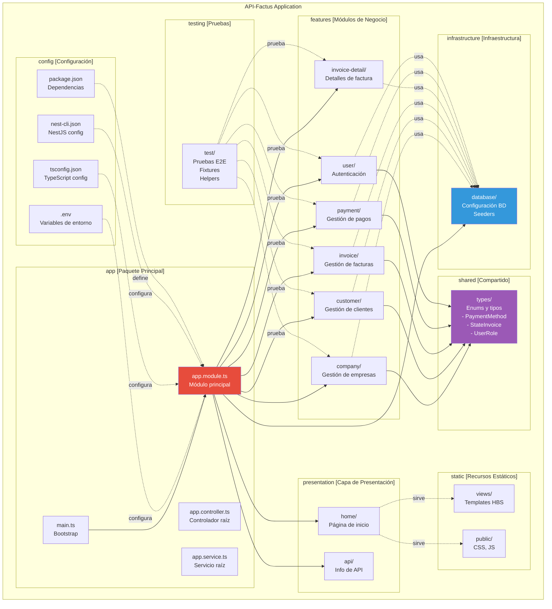

---

## 🏗️ Estructura Detallada de Paquetes por Módulo

```mermaid
graph TB
    subgraph "company [Paquete Company]"
        COMP_MOD[company.module.ts]
        COMP_CTRL[company.controller.ts]
        COMP_SVC[company.service.ts]
        
        subgraph "company/entities"
            COMP_ENT[company.entity.ts]
        end
        
        subgraph "company/dto"
            COMP_CREATE[create-company.dto.ts]
            COMP_UPDATE[update-company.dto.ts]
        end
        
        subgraph "company/test"
            COMP_CTRL_TEST[company.controller.spec.ts]
            COMP_SVC_TEST[company.service.spec.ts]
        end
    end

    subgraph "customer [Paquete Customer]"
        CUST_MOD[customer.module.ts]
        CUST_CTRL[customer.controller.ts]
        CUST_SVC[customer.service.ts]
        
        subgraph "customer/entities"
            CUST_ENT[customer.entity.ts]
        end
        
        subgraph "customer/dto"
            CUST_CREATE[create-customer.dto.ts]
            CUST_UPDATE[update-customer.dto.ts]
        end
        
        subgraph "customer/test"
            CUST_CTRL_TEST[customer.controller.spec.ts]
            CUST_SVC_TEST[customer.service.spec.ts]
        end
    end

    subgraph "invoice [Paquete Invoice]"
        INV_MOD[invoice.module.ts]
        INV_CTRL[invoice.controller.ts]
        INV_SVC[invoice.service.ts]
        
        subgraph "invoice/entities"
            INV_ENT[invoice.entity.ts]
        end
        
        subgraph "invoice/dto"
            INV_CREATE[create-invoice.dto.ts]
            INV_UPDATE[update-invoice.dto.ts]
        end
        
        subgraph "invoice/test"
            INV_CTRL_TEST[invoice.controller.spec.ts]
            INV_SVC_TEST[invoice.service.spec.ts]
        end
    end

    subgraph "invoice-detail [Paquete InvoiceDetail]"
        DET_MOD[invoice-detail.module.ts]
        DET_CTRL[invoice-detail.controller.ts]
        DET_SVC[invoice-detail.service.ts]
        
        subgraph "invoice-detail/entities"
            DET_ENT[invoice-detail.entity.ts]
        end
        
        subgraph "invoice-detail/dto"
            DET_CREATE[create-invoice-detail.dto.ts]
            DET_UPDATE[update-invoice-detail.dto.ts]
        end
        
        subgraph "invoice-detail/test"
            DET_CTRL_TEST[invoice-detail.controller.spec.ts]
            DET_SVC_TEST[invoice-detail.service.spec.ts]
        end
    end

    subgraph "payment [Paquete Payment]"
        PAY_MOD[payment.module.ts]
        PAY_CTRL[payment.controller.ts]
        PAY_SVC[payment.service.ts]
        
        subgraph "payment/entities"
            PAY_ENT[payment.entity.ts]
        end
        
        subgraph "payment/dto"
            PAY_CREATE[create-payment.dto.ts]
            PAY_UPDATE[update-payment.dto.ts]
        end
        
        subgraph "payment/test"
            PAY_CTRL_TEST[payment.controller.spec.ts]
            PAY_SVC_TEST[payment.service.spec.ts]
        end
    end

    subgraph "user [Paquete User]"
        USER_MOD[user.module.ts]
        USER_CTRL[user.controller.ts]
        USER_SVC[user.service.ts]
        
        subgraph "user/entities"
            USER_ENT[user.entity.ts]
        end
        
        subgraph "user/dto"
            USER_CREATE[create-user.dto.ts]
            USER_UPDATE[update-user.dto.ts]
            USER_LOGIN[login-user.dto.ts]
        end
    end

    %% Relaciones dentro de cada paquete
    COMP_MOD --> COMP_CTRL
    COMP_MOD --> COMP_SVC
    COMP_CTRL --> COMP_SVC
    COMP_SVC --> COMP_ENT
    COMP_CTRL --> COMP_CREATE
    COMP_CTRL --> COMP_UPDATE

    CUST_MOD --> CUST_CTRL
    CUST_MOD --> CUST_SVC
    CUST_CTRL --> CUST_SVC
    CUST_SVC --> CUST_ENT
    CUST_CTRL --> CUST_CREATE
    CUST_CTRL --> CUST_UPDATE

    INV_MOD --> INV_CTRL
    INV_MOD --> INV_SVC
    INV_CTRL --> INV_SVC
    INV_SVC --> INV_ENT
    INV_CTRL --> INV_CREATE
    INV_CTRL --> INV_UPDATE

    DET_MOD --> DET_CTRL
    DET_MOD --> DET_SVC
    DET_CTRL --> DET_SVC
    DET_SVC --> DET_ENT
    DET_CTRL --> DET_CREATE
    DET_CTRL --> DET_UPDATE

    PAY_MOD --> PAY_CTRL
    PAY_MOD --> PAY_SVC
    PAY_CTRL --> PAY_SVC
    PAY_SVC --> PAY_ENT
    PAY_CTRL --> PAY_CREATE
    PAY_CTRL --> PAY_UPDATE

    USER_MOD --> USER_CTRL
    USER_MOD --> USER_SVC
    USER_CTRL --> USER_SVC
    USER_SVC --> USER_ENT
    USER_CTRL --> USER_CREATE
    USER_CTRL --> USER_UPDATE
    USER_CTRL --> USER_LOGIN

    style COMP_MOD fill:#3498db,color:#fff
    style CUST_MOD fill:#2ecc71,color:#fff
    style INV_MOD fill:#e74c3c,color:#fff
    style DET_MOD fill:#f39c12,color:#fff
    style PAY_MOD fill:#9b59b6,color:#fff
    style USER_MOD fill:#1abc9c,color:#fff
```

---

## 📚 Dependencias entre Paquetes de Dominio

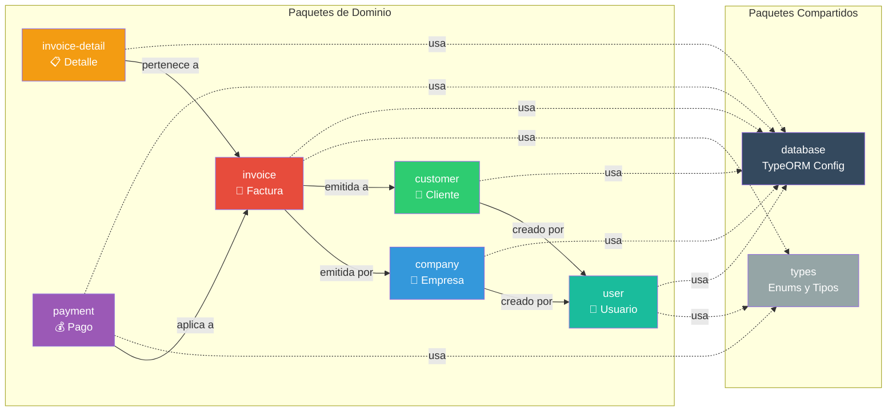

---

## 📦 Dependencias de NPM (package.json)

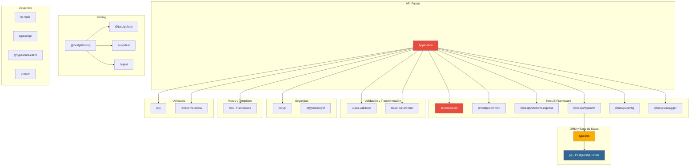

---

## 🔗 Diagrama de Dependencias Detallado

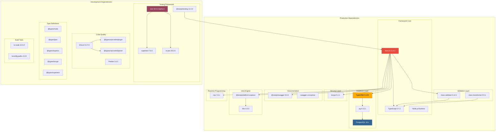

---

## 📊 Paquetes por Capa de Arquitectura

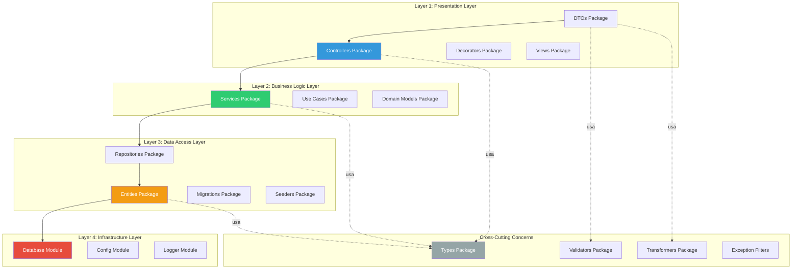

---

## 🧩 Paquetes de Pruebas (Testing)

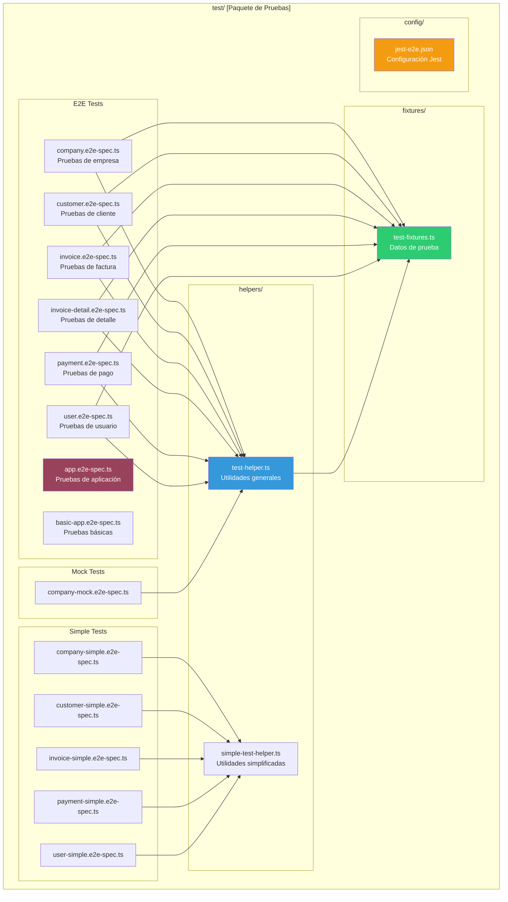

---

## 🗂️ Paquetes de Configuración

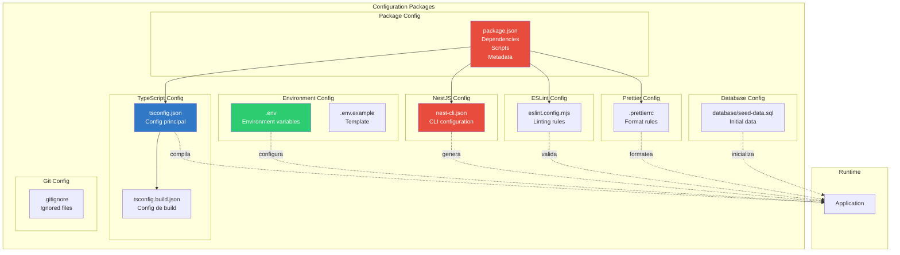

---

## 🎯 Paquetes por Responsabilidad

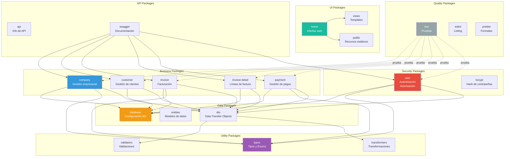

---

## 📈 Métricas de Paquetes

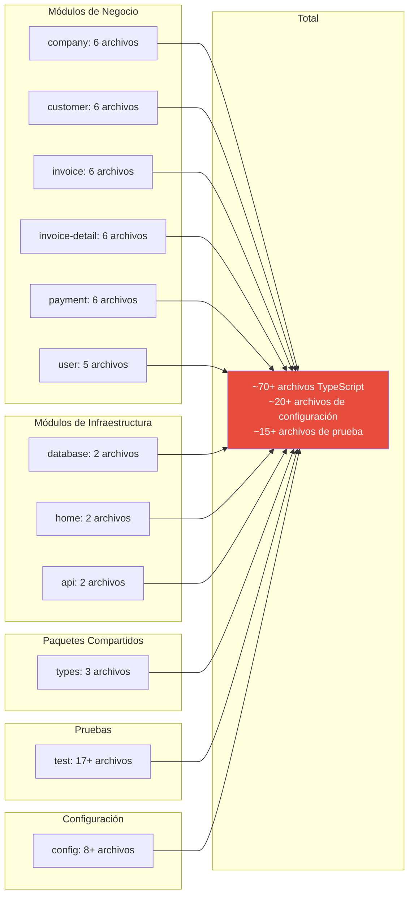

---

## 🔄 Flujo de Dependencias de Paquetes

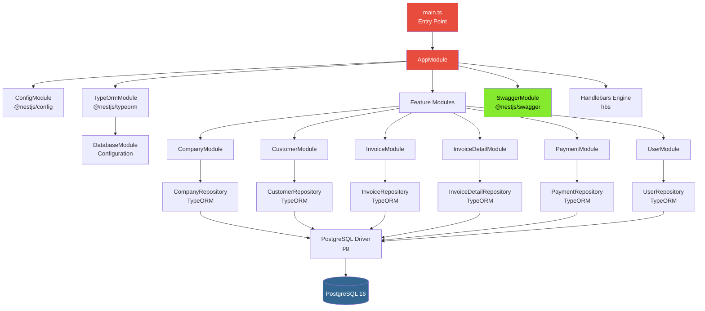

---

## 📦 Resumen de Paquetes

| Categoría | Paquetes | Descripción |
|-----------|----------|-------------|
| **Negocio** | company, customer, invoice, invoice-detail, payment, user | Lógica de dominio y casos de uso |
| **Infraestructura** | database, config | Configuración de base de datos y entorno |
| **Presentación** | home, api, views, public | Interfaz web y API REST |
| **Compartido** | types | Tipos, enums e interfaces compartidas |
| **Validación** | dto | Data Transfer Objects con validaciones |
| **Datos** | entities | Modelos de TypeORM |
| **Pruebas** | test | Pruebas unitarias y E2E |
| **Configuración** | config files | Archivos de configuración del proyecto |

---

## 🎨 Convenciones de Paquetes

### Estructura de un Paquete de Dominio:
```
<feature>/
├── <feature>.module.ts          # Módulo NestJS
├── <feature>.controller.ts      # Controlador REST
├── <feature>.service.ts         # Lógica de negocio
├── <feature>.controller.spec.ts # Pruebas unitarias controlador
├── <feature>.service.spec.ts    # Pruebas unitarias servicio
├── dto/
│   ├── create-<feature>.dto.ts  # DTO de creación
│   └── update-<feature>.dto.ts  # DTO de actualización
└── entities/
    └── <feature>.entity.ts      # Entidad TypeORM
```

### Principios de Diseño:
- **Alta Cohesión**: Cada paquete agrupa elementos relacionados
- **Bajo Acoplamiento**: Dependencias mínimas entre paquetes
- **Separación de Responsabilidades**: Cada paquete tiene un propósito único
- **Reutilización**: Paquetes compartidos para código común
- **Testabilidad**: Cada paquete es independientemente testeable

---

## 🔍 Cómo Visualizar estos Diagramas

### Opción 1: GitHub / GitLab
Los diagramas Mermaid se renderizan automáticamente en GitHub y GitLab.

### Opción 2: VS Code
Instala la extensión **Markdown Preview Mermaid Support**:
```bash
code --install-extension bierner.markdown-mermaid
```

### Opción 3: Mermaid Live Editor
Visita: https://mermaid.live/

### Opción 4: Herramientas de Documentación
- MkDocs con plugin mermaid2
- Docusaurus con soporte Mermaid
- GitBook con soporte Mermaid

---

**Generado:** 4 de Noviembre, 2025  
**Proyecto:** API-Factus  
**Versión:** 1.0.0  
**Arquitectura:** NestJS + TypeORM + PostgreSQL
