# 🔄 Diagramas de Secuencia - API-Factus

Este documento contiene los diagramas de secuencia que muestran la interacción entre los componentes del sistema de facturación API-Factus.

---

## 📝 Tabla de Contenidos

1. [Autenticación](#autenticación)
   - Registro de Usuario
   - Inicio de Sesión
2. [Gestión de Empresas](#gestión-de-empresas)
   - Crear Empresa
   - Consultar Empresa
3. [Gestión de Clientes](#gestión-de-clientes)
   - Crear Cliente
   - Buscar Cliente
4. [Gestión de Facturas](#gestión-de-facturas)
   - Crear Factura
   - Agregar Detalles a Factura
   - Cambiar Estado de Factura
5. [Gestión de Pagos](#gestión-de-pagos)
   - Registrar Pago
   - Consultar Pagos de Factura
6. [Flujos Completos](#flujos-completos)
   - Ciclo Completo de Facturación
   - Proceso de Pago Completo

---

## 🔐 Autenticación

### Registro de Usuario

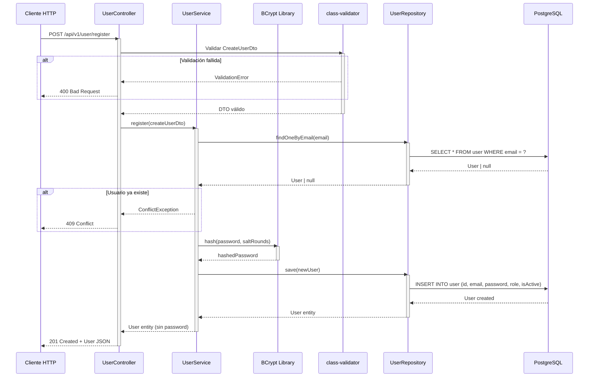
```mermaid
sequenceDiagram
    participant Client as Cliente HTTP
    participant Controller as UserController
    participant Service as UserService
    participant BCrypt as BCrypt Library
    participant Validator as class-validator
    participant Repo as UserRepository
    participant DB as PostgreSQL

    Client->>Controller: POST /api/v1/user/register
    activate Controller
    
    Controller->>Validator: Validar CreateUserDto
    activate Validator
    alt Validación fallida
        Validator-->>Controller: ValidationError
        Controller-->>Client: 400 Bad Request
    end
    Validator-->>Controller: DTO válido
    deactivate Validator
    
    Controller->>Service: register(createUserDto)
    activate Service
    
    Service->>Repo: findOneByEmail(email)
    activate Repo
    Repo->>DB: SELECT * FROM user WHERE email = ?
    DB-->>Repo: User | null
    Repo-->>Service: User | null
    deactivate Repo
    
    alt Usuario ya existe
        Service-->>Controller: ConflictException
        Controller-->>Client: 409 Conflict
    end
    
    Service->>BCrypt: hash(password, saltRounds)
    activate BCrypt
    BCrypt-->>Service: hashedPassword
    deactivate BCrypt
    
    Service->>Repo: save(newUser)
    activate Repo
    Repo->>DB: INSERT INTO user (id, email, password, role, isActive)
    DB-->>Repo: User created
    Repo-->>Service: User entity
    deactivate Repo
    
    Service-->>Controller: User entity (sin password)
    deactivate Service
    
    Controller-->>Client: 201 Created + User JSON
    deactivate Controller
```

---

### Inicio de Sesión

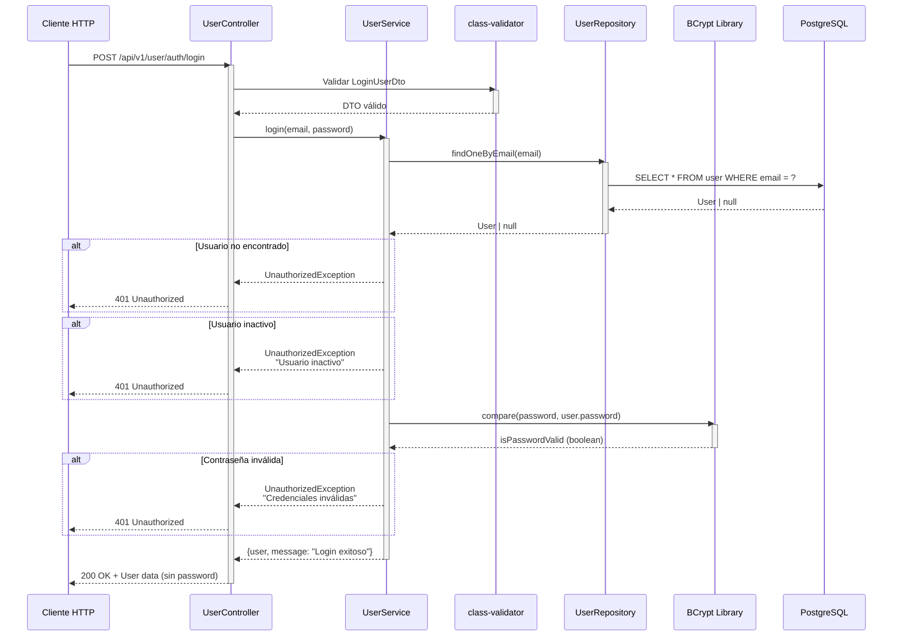
```mermaid
sequenceDiagram
    participant Client as Cliente HTTP
    participant Controller as UserController
    participant Service as UserService
    participant Validator as class-validator
    participant Repo as UserRepository
    participant BCrypt as BCrypt Library
    participant DB as PostgreSQL

    Client->>Controller: POST /api/v1/user/auth/login
    activate Controller
    
    Controller->>Validator: Validar LoginUserDto
    activate Validator
    Validator-->>Controller: DTO válido
    deactivate Validator
    
    Controller->>Service: login(email, password)
    activate Service
    
    Service->>Repo: findOneByEmail(email)
    activate Repo
    Repo->>DB: SELECT * FROM user WHERE email = ?
    DB-->>Repo: User | null
    Repo-->>Service: User | null
    deactivate Repo
    
    alt Usuario no encontrado
        Service-->>Controller: UnauthorizedException
        Controller-->>Client: 401 Unauthorized
    end
    
    alt Usuario inactivo
        Service-->>Controller: UnauthorizedException<br/>"Usuario inactivo"
        Controller-->>Client: 401 Unauthorized
    end
    
    Service->>BCrypt: compare(password, user.password)
    activate BCrypt
    BCrypt-->>Service: isPasswordValid (boolean)
    deactivate BCrypt
    
    alt Contraseña inválida
        Service-->>Controller: UnauthorizedException<br/>"Credenciales inválidas"
        Controller-->>Client: 401 Unauthorized
    end
    
    Service-->>Controller: {user, message: "Login exitoso"}
    deactivate Service
    
    Controller-->>Client: 200 OK + User data (sin password)
    deactivate Controller
```

---

## 🏢 Gestión de Empresas

### Crear Empresa

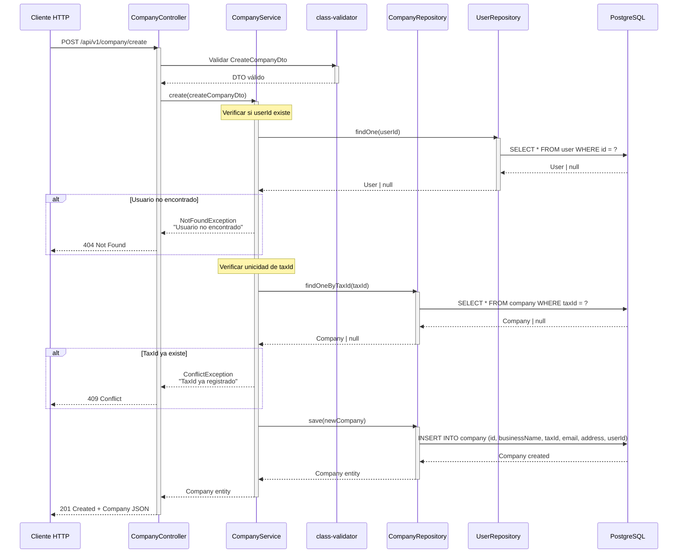
```mermaid
sequenceDiagram
    participant Client as Cliente HTTP
    participant Controller as CompanyController
    participant Service as CompanyService
    participant Validator as class-validator
    participant CompanyRepo as CompanyRepository
    participant UserRepo as UserRepository
    participant DB as PostgreSQL

    Client->>Controller: POST /api/v1/company/create
    activate Controller
    
    Controller->>Validator: Validar CreateCompanyDto
    activate Validator
    Validator-->>Controller: DTO válido
    deactivate Validator
    
    Controller->>Service: create(createCompanyDto)
    activate Service
    
    Note over Service: Verificar si userId existe
    Service->>UserRepo: findOne(userId)
    activate UserRepo
    UserRepo->>DB: SELECT * FROM user WHERE id = ?
    DB-->>UserRepo: User | null
    UserRepo-->>Service: User | null
    deactivate UserRepo
    
    alt Usuario no encontrado
        Service-->>Controller: NotFoundException<br/>"Usuario no encontrado"
        Controller-->>Client: 404 Not Found
    end
    
    Note over Service: Verificar unicidad de taxId
    Service->>CompanyRepo: findOneByTaxId(taxId)
    activate CompanyRepo
    CompanyRepo->>DB: SELECT * FROM company WHERE taxId = ?
    DB-->>CompanyRepo: Company | null
    CompanyRepo-->>Service: Company | null
    deactivate CompanyRepo
    
    alt TaxId ya existe
        Service-->>Controller: ConflictException<br/>"TaxId ya registrado"
        Controller-->>Client: 409 Conflict
    end
    
    Service->>CompanyRepo: save(newCompany)
    activate CompanyRepo
    CompanyRepo->>DB: INSERT INTO company (id, businessName, taxId, email, address, userId)
    DB-->>CompanyRepo: Company created
    CompanyRepo-->>Service: Company entity
    deactivate CompanyRepo
    
    Service-->>Controller: Company entity
    deactivate Service
    
    Controller-->>Client: 201 Created + Company JSON
    deactivate Controller
```

---

### Consultar Empresa por ID

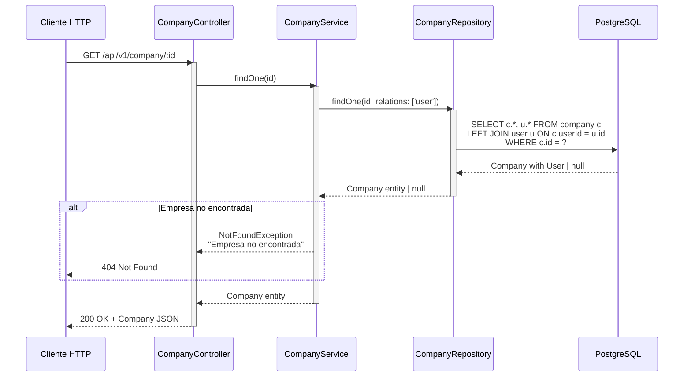
```mermaid
sequenceDiagram
    participant Client as Cliente HTTP
    participant Controller as CompanyController
    participant Service as CompanyService
    participant Repo as CompanyRepository
    participant DB as PostgreSQL

    Client->>Controller: GET /api/v1/company/:id
    activate Controller
    
    Controller->>Service: findOne(id)
    activate Service
    
    Service->>Repo: findOne(id, relations: ['user'])
    activate Repo
    Repo->>DB: SELECT c.*, u.* FROM company c<br/>LEFT JOIN user u ON c.userId = u.id<br/>WHERE c.id = ?
    DB-->>Repo: Company with User | null
    Repo-->>Service: Company entity | null
    deactivate Repo
    
    alt Empresa no encontrada
        Service-->>Controller: NotFoundException<br/>"Empresa no encontrada"
        Controller-->>Client: 404 Not Found
    end
    
    Service-->>Controller: Company entity
    deactivate Service
    
    Controller-->>Client: 200 OK + Company JSON
    deactivate Controller
```

---

## 👥 Gestión de Clientes

### Crear Cliente

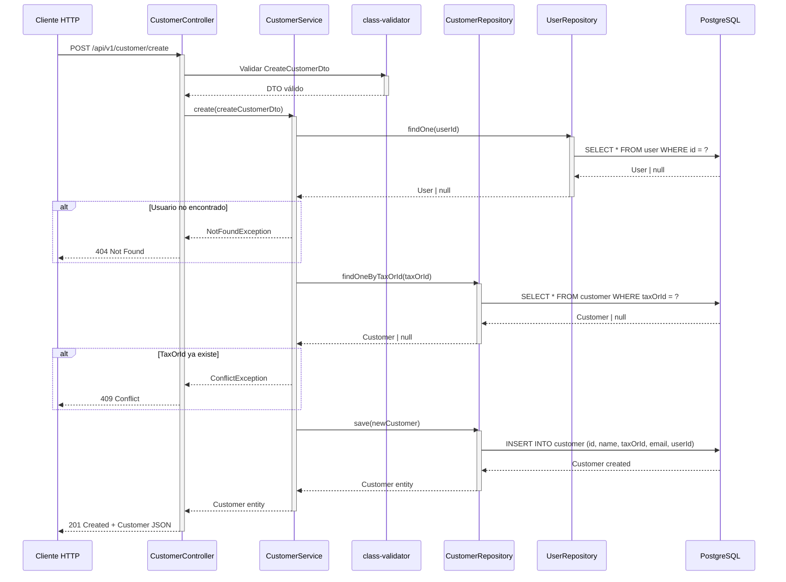
```mermaid
sequenceDiagram
    participant Client as Cliente HTTP
    participant Controller as CustomerController
    participant Service as CustomerService
    participant Validator as class-validator
    participant CustomerRepo as CustomerRepository
    participant UserRepo as UserRepository
    participant DB as PostgreSQL

    Client->>Controller: POST /api/v1/customer/create
    activate Controller
    
    Controller->>Validator: Validar CreateCustomerDto
    activate Validator
    Validator-->>Controller: DTO válido
    deactivate Validator
    
    Controller->>Service: create(createCustomerDto)
    activate Service
    
    Service->>UserRepo: findOne(userId)
    activate UserRepo
    UserRepo->>DB: SELECT * FROM user WHERE id = ?
    DB-->>UserRepo: User | null
    UserRepo-->>Service: User | null
    deactivate UserRepo
    
    alt Usuario no encontrado
        Service-->>Controller: NotFoundException
        Controller-->>Client: 404 Not Found
    end
    
    Service->>CustomerRepo: findOneByTaxOrId(taxOrId)
    activate CustomerRepo
    CustomerRepo->>DB: SELECT * FROM customer WHERE taxOrId = ?
    DB-->>CustomerRepo: Customer | null
    CustomerRepo-->>Service: Customer | null
    deactivate CustomerRepo
    
    alt TaxOrId ya existe
        Service-->>Controller: ConflictException
        Controller-->>Client: 409 Conflict
    end
    
    Service->>CustomerRepo: save(newCustomer)
    activate CustomerRepo
    CustomerRepo->>DB: INSERT INTO customer (id, name, taxOrId, email, userId)
    DB-->>CustomerRepo: Customer created
    CustomerRepo-->>Service: Customer entity
    deactivate CustomerRepo
    
    Service-->>Controller: Customer entity
    deactivate Service
    
    Controller-->>Client: 201 Created + Customer JSON
    deactivate Controller
```

---

### Buscar Clientes con Filtros

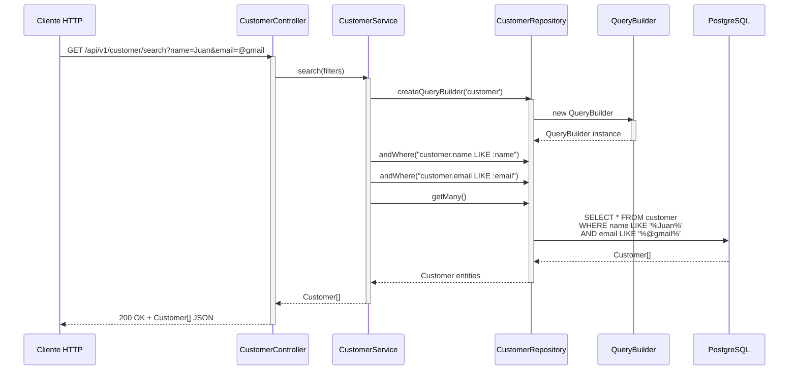
```mermaid
sequenceDiagram
    participant Client as Cliente HTTP
    participant Controller as CustomerController
    participant Service as CustomerService
    participant Repo as CustomerRepository
    participant QB as QueryBuilder
    participant DB as PostgreSQL

    Client->>Controller: GET /api/v1/customer/search?name=Juan&email=@gmail
    activate Controller
    
    Controller->>Service: search(filters)
    activate Service
    
    Service->>Repo: createQueryBuilder('customer')
    activate Repo
    Repo->>QB: new QueryBuilder
    activate QB
    QB-->>Repo: QueryBuilder instance
    deactivate QB
    
    Service->>Repo: andWhere("customer.name LIKE :name")
    Service->>Repo: andWhere("customer.email LIKE :email")
    Service->>Repo: getMany()
    
    Repo->>DB: SELECT * FROM customer<br/>WHERE name LIKE '%Juan%'<br/>AND email LIKE '%@gmail%'
    DB-->>Repo: Customer[]
    Repo-->>Service: Customer entities
    deactivate Repo
    
    Service-->>Controller: Customer[]
    deactivate Service
    
    Controller-->>Client: 200 OK + Customer[] JSON
    deactivate Controller
```

---

## 📄 Gestión de Facturas

### Crear Factura

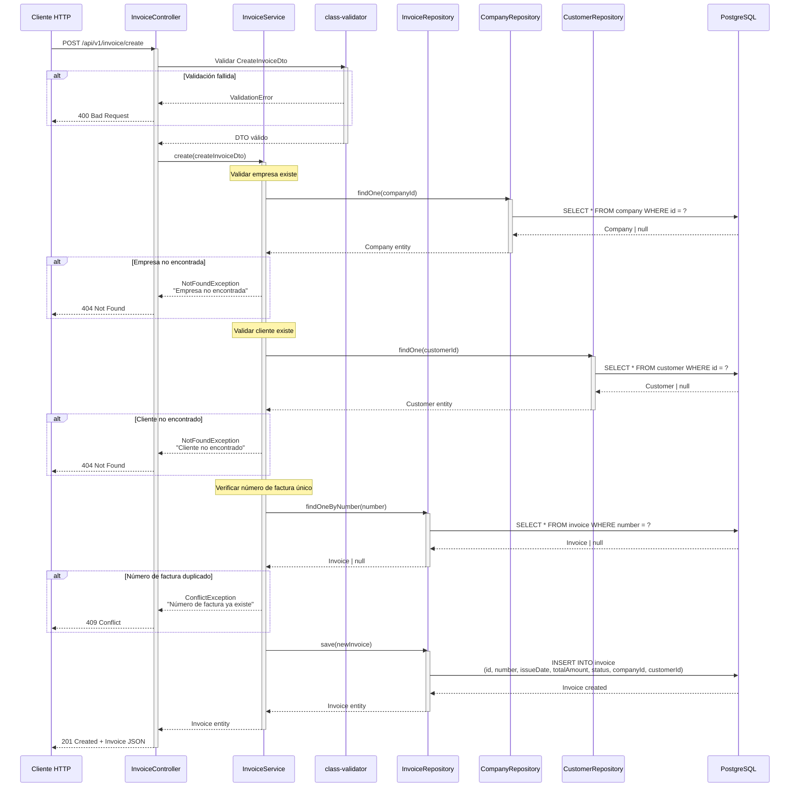
```mermaid
sequenceDiagram
    participant Client as Cliente HTTP
    participant Controller as InvoiceController
    participant Service as InvoiceService
    participant Validator as class-validator
    participant InvoiceRepo as InvoiceRepository
    participant CompanyRepo as CompanyRepository
    participant CustomerRepo as CustomerRepository
    participant DB as PostgreSQL

    Client->>Controller: POST /api/v1/invoice/create
    activate Controller
    
    Controller->>Validator: Validar CreateInvoiceDto
    activate Validator
    alt Validación fallida
        Validator-->>Controller: ValidationError
        Controller-->>Client: 400 Bad Request
    end
    Validator-->>Controller: DTO válido
    deactivate Validator
    
    Controller->>Service: create(createInvoiceDto)
    activate Service
    
    Note over Service: Validar empresa existe
    Service->>CompanyRepo: findOne(companyId)
    activate CompanyRepo
    CompanyRepo->>DB: SELECT * FROM company WHERE id = ?
    DB-->>CompanyRepo: Company | null
    CompanyRepo-->>Service: Company entity
    deactivate CompanyRepo
    
    alt Empresa no encontrada
        Service-->>Controller: NotFoundException<br/>"Empresa no encontrada"
        Controller-->>Client: 404 Not Found
    end
    
    Note over Service: Validar cliente existe
    Service->>CustomerRepo: findOne(customerId)
    activate CustomerRepo
    CustomerRepo->>DB: SELECT * FROM customer WHERE id = ?
    DB-->>CustomerRepo: Customer | null
    CustomerRepo-->>Service: Customer entity
    deactivate CustomerRepo
    
    alt Cliente no encontrado
        Service-->>Controller: NotFoundException<br/>"Cliente no encontrado"
        Controller-->>Client: 404 Not Found
    end
    
    Note over Service: Verificar número de factura único
    Service->>InvoiceRepo: findOneByNumber(number)
    activate InvoiceRepo
    InvoiceRepo->>DB: SELECT * FROM invoice WHERE number = ?
    DB-->>InvoiceRepo: Invoice | null
    InvoiceRepo-->>Service: Invoice | null
    deactivate InvoiceRepo
    
    alt Número de factura duplicado
        Service-->>Controller: ConflictException<br/>"Número de factura ya existe"
        Controller-->>Client: 409 Conflict
    end
    
    Service->>InvoiceRepo: save(newInvoice)
    activate InvoiceRepo
    InvoiceRepo->>DB: INSERT INTO invoice<br/>(id, number, issueDate, totalAmount, status, companyId, customerId)
    DB-->>InvoiceRepo: Invoice created
    InvoiceRepo-->>Service: Invoice entity
    deactivate InvoiceRepo
    
    Service-->>Controller: Invoice entity
    deactivate Service
    
    Controller-->>Client: 201 Created + Invoice JSON
    deactivate Controller
```

---

### Agregar Detalle a Factura

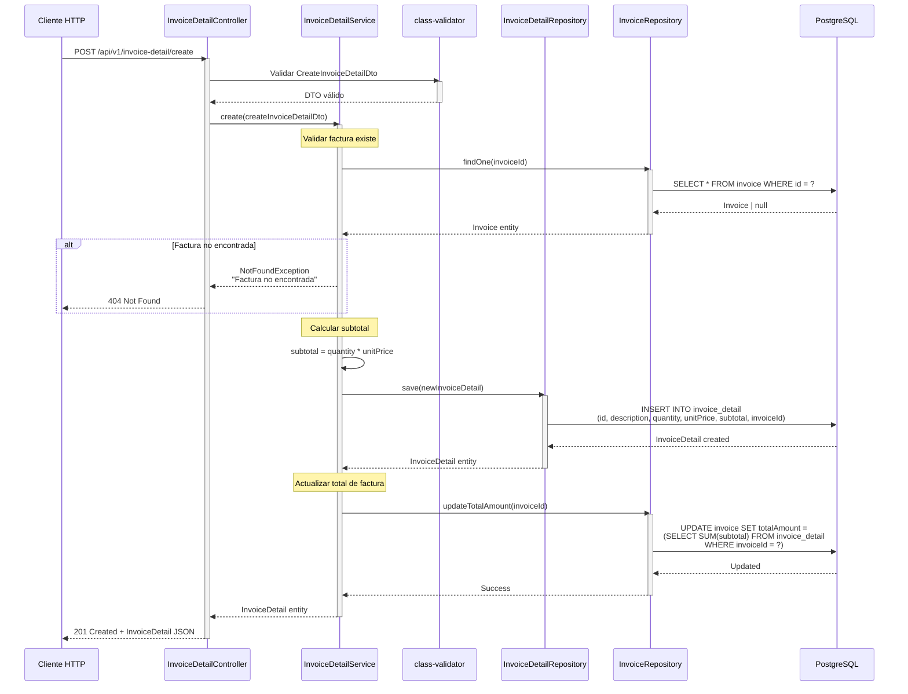
```mermaid
sequenceDiagram
    participant Client as Cliente HTTP
    participant Controller as InvoiceDetailController
    participant Service as InvoiceDetailService
    participant Validator as class-validator
    participant DetailRepo as InvoiceDetailRepository
    participant InvoiceRepo as InvoiceRepository
    participant DB as PostgreSQL

    Client->>Controller: POST /api/v1/invoice-detail/create
    activate Controller
    
    Controller->>Validator: Validar CreateInvoiceDetailDto
    activate Validator
    Validator-->>Controller: DTO válido
    deactivate Validator
    
    Controller->>Service: create(createInvoiceDetailDto)
    activate Service
    
    Note over Service: Validar factura existe
    Service->>InvoiceRepo: findOne(invoiceId)
    activate InvoiceRepo
    InvoiceRepo->>DB: SELECT * FROM invoice WHERE id = ?
    DB-->>InvoiceRepo: Invoice | null
    InvoiceRepo-->>Service: Invoice entity
    deactivate InvoiceRepo
    
    alt Factura no encontrada
        Service-->>Controller: NotFoundException<br/>"Factura no encontrada"
        Controller-->>Client: 404 Not Found
    end
    
    Note over Service: Calcular subtotal
    Service->>Service: subtotal = quantity * unitPrice
    
    Service->>DetailRepo: save(newInvoiceDetail)
    activate DetailRepo
    DetailRepo->>DB: INSERT INTO invoice_detail<br/>(id, description, quantity, unitPrice, subtotal, invoiceId)
    DB-->>DetailRepo: InvoiceDetail created
    DetailRepo-->>Service: InvoiceDetail entity
    deactivate DetailRepo
    
    Note over Service: Actualizar total de factura
    Service->>InvoiceRepo: updateTotalAmount(invoiceId)
    activate InvoiceRepo
    InvoiceRepo->>DB: UPDATE invoice SET totalAmount =<br/>(SELECT SUM(subtotal) FROM invoice_detail<br/>WHERE invoiceId = ?)
    DB-->>InvoiceRepo: Updated
    InvoiceRepo-->>Service: Success
    deactivate InvoiceRepo
    
    Service-->>Controller: InvoiceDetail entity
    deactivate Service
    
    Controller-->>Client: 201 Created + InvoiceDetail JSON
    deactivate Controller
```

---

### Cambiar Estado de Factura a PAID

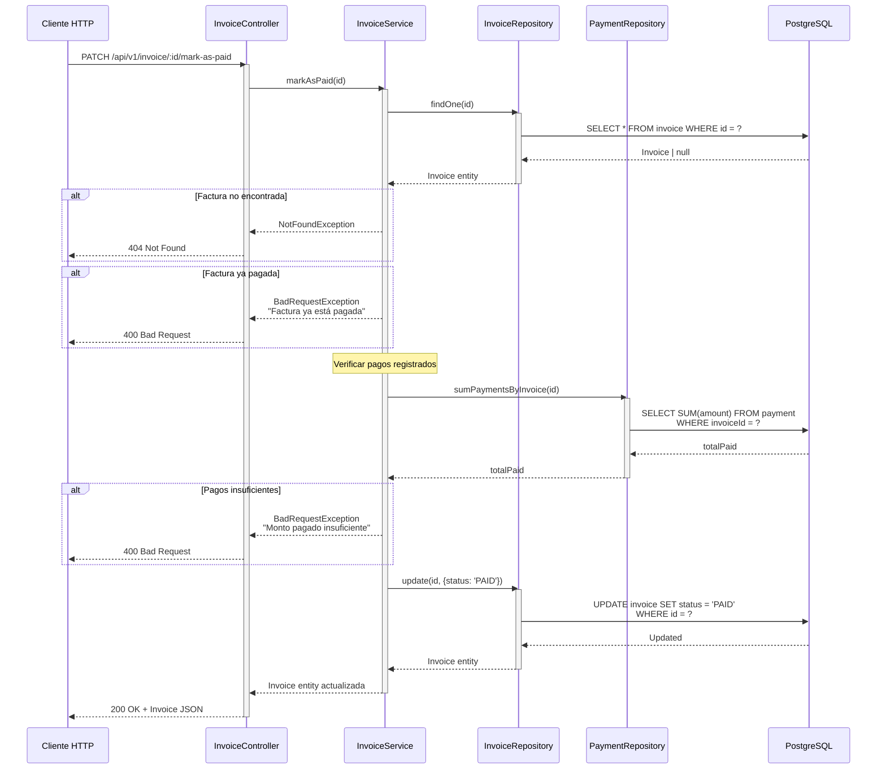
```mermaid
sequenceDiagram
    participant Client as Cliente HTTP
    participant Controller as InvoiceController
    participant Service as InvoiceService
    participant InvoiceRepo as InvoiceRepository
    participant PaymentRepo as PaymentRepository
    participant DB as PostgreSQL

    Client->>Controller: PATCH /api/v1/invoice/:id/mark-as-paid
    activate Controller
    
    Controller->>Service: markAsPaid(id)
    activate Service
    
    Service->>InvoiceRepo: findOne(id)
    activate InvoiceRepo
    InvoiceRepo->>DB: SELECT * FROM invoice WHERE id = ?
    DB-->>InvoiceRepo: Invoice | null
    InvoiceRepo-->>Service: Invoice entity
    deactivate InvoiceRepo
    
    alt Factura no encontrada
        Service-->>Controller: NotFoundException
        Controller-->>Client: 404 Not Found
    end
    
    alt Factura ya pagada
        Service-->>Controller: BadRequestException<br/>"Factura ya está pagada"
        Controller-->>Client: 400 Bad Request
    end
    
    Note over Service: Verificar pagos registrados
    Service->>PaymentRepo: sumPaymentsByInvoice(id)
    activate PaymentRepo
    PaymentRepo->>DB: SELECT SUM(amount) FROM payment<br/>WHERE invoiceId = ?
    DB-->>PaymentRepo: totalPaid
    PaymentRepo-->>Service: totalPaid
    deactivate PaymentRepo
    
    alt Pagos insuficientes
        Service-->>Controller: BadRequestException<br/>"Monto pagado insuficiente"
        Controller-->>Client: 400 Bad Request
    end
    
    Service->>InvoiceRepo: update(id, {status: 'PAID'})
    activate InvoiceRepo
    InvoiceRepo->>DB: UPDATE invoice SET status = 'PAID'<br/>WHERE id = ?
    DB-->>InvoiceRepo: Updated
    InvoiceRepo-->>Service: Invoice entity
    deactivate InvoiceRepo
    
    Service-->>Controller: Invoice entity actualizada
    deactivate Service
    
    Controller-->>Client: 200 OK + Invoice JSON
    deactivate Controller
```

---

## 💰 Gestión de Pagos

### Registrar Pago

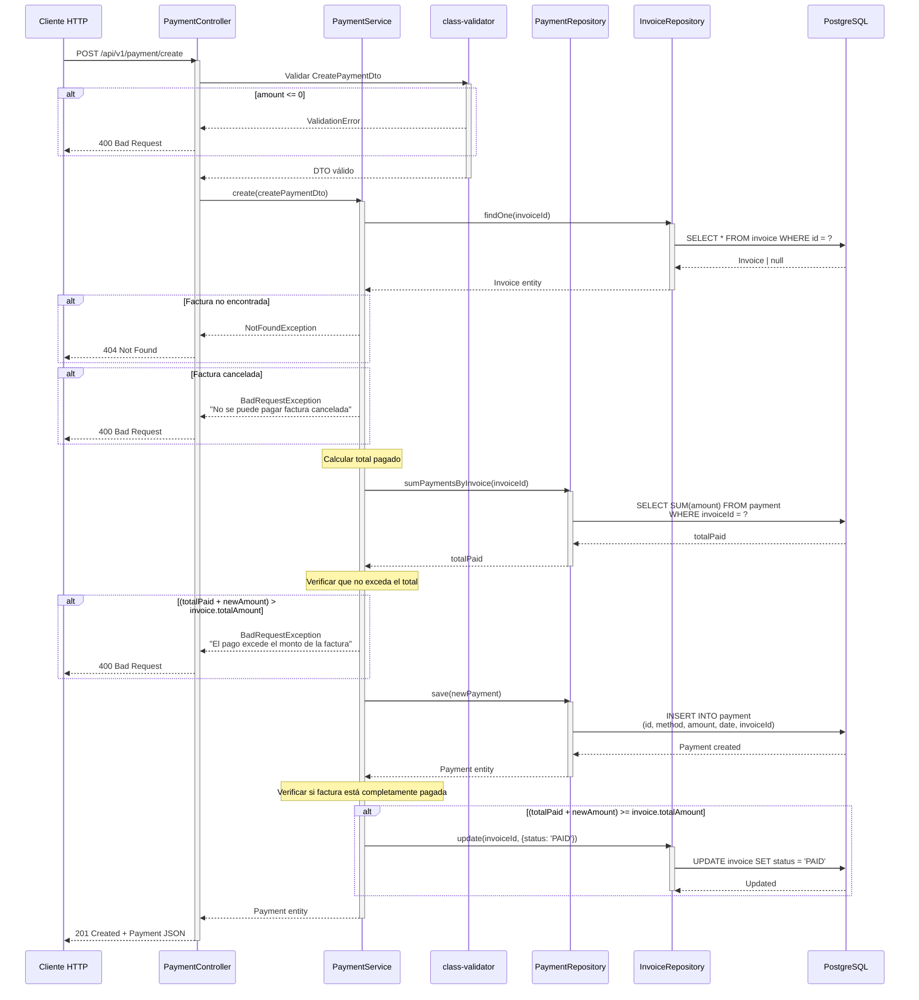
```mermaid
sequenceDiagram
    participant Client as Cliente HTTP
    participant Controller as PaymentController
    participant Service as PaymentService
    participant Validator as class-validator
    participant PaymentRepo as PaymentRepository
    participant InvoiceRepo as InvoiceRepository
    participant DB as PostgreSQL

    Client->>Controller: POST /api/v1/payment/create
    activate Controller
    
    Controller->>Validator: Validar CreatePaymentDto
    activate Validator
    alt amount <= 0
        Validator-->>Controller: ValidationError
        Controller-->>Client: 400 Bad Request
    end
    Validator-->>Controller: DTO válido
    deactivate Validator
    
    Controller->>Service: create(createPaymentDto)
    activate Service
    
    Service->>InvoiceRepo: findOne(invoiceId)
    activate InvoiceRepo
    InvoiceRepo->>DB: SELECT * FROM invoice WHERE id = ?
    DB-->>InvoiceRepo: Invoice | null
    InvoiceRepo-->>Service: Invoice entity
    deactivate InvoiceRepo
    
    alt Factura no encontrada
        Service-->>Controller: NotFoundException
        Controller-->>Client: 404 Not Found
    end
    
    alt Factura cancelada
        Service-->>Controller: BadRequestException<br/>"No se puede pagar factura cancelada"
        Controller-->>Client: 400 Bad Request
    end
    
    Note over Service: Calcular total pagado
    Service->>PaymentRepo: sumPaymentsByInvoice(invoiceId)
    activate PaymentRepo
    PaymentRepo->>DB: SELECT SUM(amount) FROM payment<br/>WHERE invoiceId = ?
    DB-->>PaymentRepo: totalPaid
    PaymentRepo-->>Service: totalPaid
    deactivate PaymentRepo
    
    Note over Service: Verificar que no exceda el total
    alt (totalPaid + newAmount) > invoice.totalAmount
        Service-->>Controller: BadRequestException<br/>"El pago excede el monto de la factura"
        Controller-->>Client: 400 Bad Request
    end
    
    Service->>PaymentRepo: save(newPayment)
    activate PaymentRepo
    PaymentRepo->>DB: INSERT INTO payment<br/>(id, method, amount, date, invoiceId)
    DB-->>PaymentRepo: Payment created
    PaymentRepo-->>Service: Payment entity
    deactivate PaymentRepo
    
    Note over Service: Verificar si factura está completamente pagada
    alt (totalPaid + newAmount) >= invoice.totalAmount
        Service->>InvoiceRepo: update(invoiceId, {status: 'PAID'})
        activate InvoiceRepo
        InvoiceRepo->>DB: UPDATE invoice SET status = 'PAID'
        DB-->>InvoiceRepo: Updated
        deactivate InvoiceRepo
    end
    
    Service-->>Controller: Payment entity
    deactivate Service
    
    Controller-->>Client: 201 Created + Payment JSON
    deactivate Controller
```

---

### Consultar Pagos de una Factura

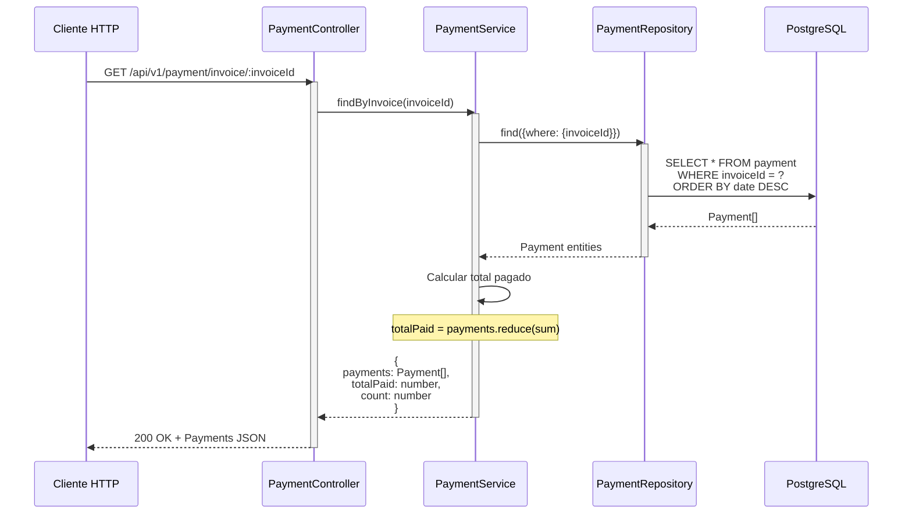
```mermaid
sequenceDiagram
    participant Client as Cliente HTTP
    participant Controller as PaymentController
    participant Service as PaymentService
    participant Repo as PaymentRepository
    participant DB as PostgreSQL

    Client->>Controller: GET /api/v1/payment/invoice/:invoiceId
    activate Controller
    
    Controller->>Service: findByInvoice(invoiceId)
    activate Service
    
    Service->>Repo: find({where: {invoiceId}})
    activate Repo
    Repo->>DB: SELECT * FROM payment<br/>WHERE invoiceId = ?<br/>ORDER BY date DESC
    DB-->>Repo: Payment[]
    Repo-->>Service: Payment entities
    deactivate Repo
    
    Service->>Service: Calcular total pagado
    Note over Service: totalPaid = payments.reduce(sum)
    
    Service-->>Controller: {<br/>  payments: Payment[],<br/>  totalPaid: number,<br/>  count: number<br/>}
    deactivate Service
    
    Controller-->>Client: 200 OK + Payments JSON
    deactivate Controller
```

---

## 🔄 Flujos Completos

### Ciclo Completo de Facturación

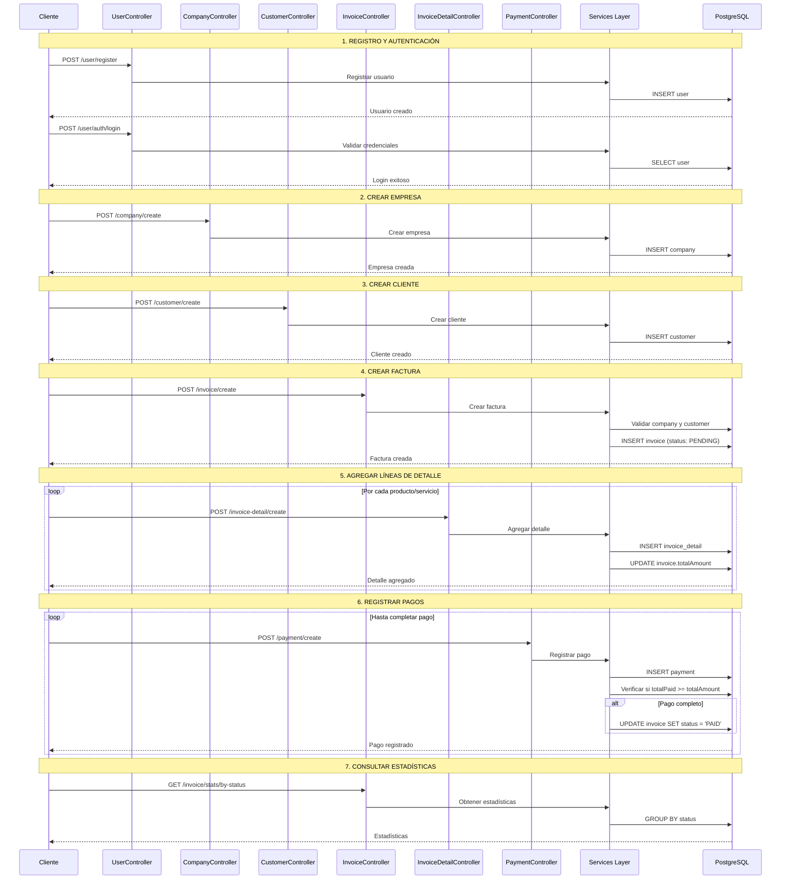
```mermaid
sequenceDiagram
    participant Client as Cliente
    participant UserCtrl as UserController
    participant CompCtrl as CompanyController
    participant CustCtrl as CustomerController
    participant InvCtrl as InvoiceController
    participant DetCtrl as InvoiceDetailController
    participant PayCtrl as PaymentController
    participant Services as Services Layer
    participant DB as PostgreSQL

    Note over Client,DB: 1. REGISTRO Y AUTENTICACIÓN
    Client->>UserCtrl: POST /user/register
    UserCtrl->>Services: Registrar usuario
    Services->>DB: INSERT user
    DB-->>Client: Usuario creado
    
    Client->>UserCtrl: POST /user/auth/login
    UserCtrl->>Services: Validar credenciales
    Services->>DB: SELECT user
    DB-->>Client: Login exitoso
    
    Note over Client,DB: 2. CREAR EMPRESA
    Client->>CompCtrl: POST /company/create
    CompCtrl->>Services: Crear empresa
    Services->>DB: INSERT company
    DB-->>Client: Empresa creada
    
    Note over Client,DB: 3. CREAR CLIENTE
    Client->>CustCtrl: POST /customer/create
    CustCtrl->>Services: Crear cliente
    Services->>DB: INSERT customer
    DB-->>Client: Cliente creado
    
    Note over Client,DB: 4. CREAR FACTURA
    Client->>InvCtrl: POST /invoice/create
    InvCtrl->>Services: Crear factura
    Services->>DB: Validar company y customer
    Services->>DB: INSERT invoice (status: PENDING)
    DB-->>Client: Factura creada
    
    Note over Client,DB: 5. AGREGAR LÍNEAS DE DETALLE
    loop Por cada producto/servicio
        Client->>DetCtrl: POST /invoice-detail/create
        DetCtrl->>Services: Agregar detalle
        Services->>DB: INSERT invoice_detail
        Services->>DB: UPDATE invoice.totalAmount
        DB-->>Client: Detalle agregado
    end
    
    Note over Client,DB: 6. REGISTRAR PAGOS
    loop Hasta completar pago
        Client->>PayCtrl: POST /payment/create
        PayCtrl->>Services: Registrar pago
        Services->>DB: INSERT payment
        Services->>DB: Verificar si totalPaid >= totalAmount
        alt Pago completo
            Services->>DB: UPDATE invoice SET status = 'PAID'
        end
        DB-->>Client: Pago registrado
    end
    
    Note over Client,DB: 7. CONSULTAR ESTADÍSTICAS
    Client->>InvCtrl: GET /invoice/stats/by-status
    InvCtrl->>Services: Obtener estadísticas
    Services->>DB: GROUP BY status
    DB-->>Client: Estadísticas
```

---

### Proceso de Pago Completo con Validaciones

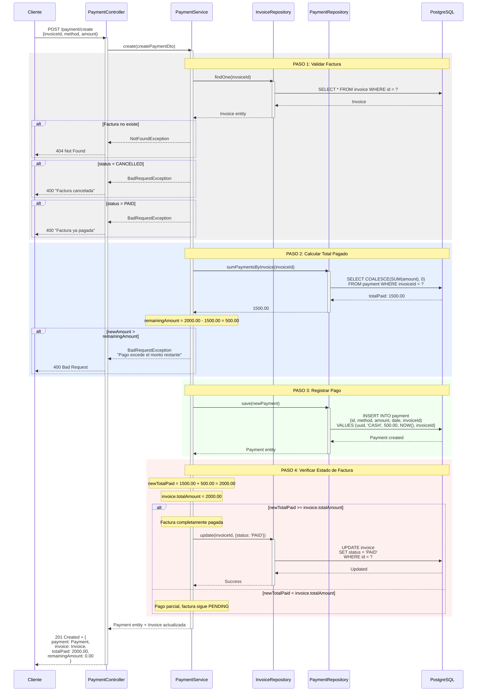
```mermaid
sequenceDiagram
    participant Client as Cliente
    participant PayCtrl as PaymentController
    participant PaySvc as PaymentService
    participant InvRepo as InvoiceRepository
    participant PayRepo as PaymentRepository
    participant DB as PostgreSQL

    Client->>PayCtrl: POST /payment/create<br/>{invoiceId, method, amount}
    activate PayCtrl
    
    PayCtrl->>PaySvc: create(createPaymentDto)
    activate PaySvc
    
    rect rgb(240, 240, 240)
        Note over PaySvc,DB: PASO 1: Validar Factura
        PaySvc->>InvRepo: findOne(invoiceId)
        activate InvRepo
        InvRepo->>DB: SELECT * FROM invoice WHERE id = ?
        DB-->>InvRepo: Invoice
        InvRepo-->>PaySvc: Invoice entity
        deactivate InvRepo
        
        alt Factura no existe
            PaySvc-->>PayCtrl: NotFoundException
            PayCtrl-->>Client: 404 Not Found
        end
        
        alt status = CANCELLED
            PaySvc-->>PayCtrl: BadRequestException
            PayCtrl-->>Client: 400 "Factura cancelada"
        end
        
        alt status = PAID
            PaySvc-->>PayCtrl: BadRequestException
            PayCtrl-->>Client: 400 "Factura ya pagada"
        end
    end
    
    rect rgb(230, 240, 255)
        Note over PaySvc,DB: PASO 2: Calcular Total Pagado
        PaySvc->>PayRepo: sumPaymentsByInvoice(invoiceId)
        activate PayRepo
        PayRepo->>DB: SELECT COALESCE(SUM(amount), 0)<br/>FROM payment WHERE invoiceId = ?
        DB-->>PayRepo: totalPaid: 1500.00
        PayRepo-->>PaySvc: 1500.00
        deactivate PayRepo
        
        Note over PaySvc: remainingAmount = 2000.00 - 1500.00 = 500.00
        
        alt newAmount > remainingAmount
            PaySvc-->>PayCtrl: BadRequestException<br/>"Pago excede el monto restante"
            PayCtrl-->>Client: 400 Bad Request
        end
    end
    
    rect rgb(240, 255, 240)
        Note over PaySvc,DB: PASO 3: Registrar Pago
        PaySvc->>PayRepo: save(newPayment)
        activate PayRepo
        PayRepo->>DB: INSERT INTO payment<br/>(id, method, amount, date, invoiceId)<br/>VALUES (uuid, 'CASH', 500.00, NOW(), invoiceId)
        DB-->>PayRepo: Payment created
        PayRepo-->>PaySvc: Payment entity
        deactivate PayRepo
    end
    
    rect rgb(255, 240, 240)
        Note over PaySvc,DB: PASO 4: Verificar Estado de Factura
        Note over PaySvc: newTotalPaid = 1500.00 + 500.00 = 2000.00
        Note over PaySvc: invoice.totalAmount = 2000.00
        
        alt newTotalPaid >= invoice.totalAmount
            Note over PaySvc: Factura completamente pagada
            PaySvc->>InvRepo: update(invoiceId, {status: 'PAID'})
            activate InvRepo
            InvRepo->>DB: UPDATE invoice<br/>SET status = 'PAID'<br/>WHERE id = ?
            DB-->>InvRepo: Updated
            InvRepo-->>PaySvc: Success
            deactivate InvRepo
        else newTotalPaid < invoice.totalAmount
            Note over PaySvc: Pago parcial, factura sigue PENDING
        end
    end
    
    PaySvc-->>PayCtrl: Payment entity + Invoice actualizada
    deactivate PaySvc
    
    PayCtrl-->>Client: 201 Created + {<br/>  payment: Payment,<br/>  invoice: Invoice,<br/>  totalPaid: 2000.00,<br/>  remainingAmount: 0.00<br/>}
    deactivate PayCtrl
```

---

### Búsqueda y Filtrado Avanzado de Facturas

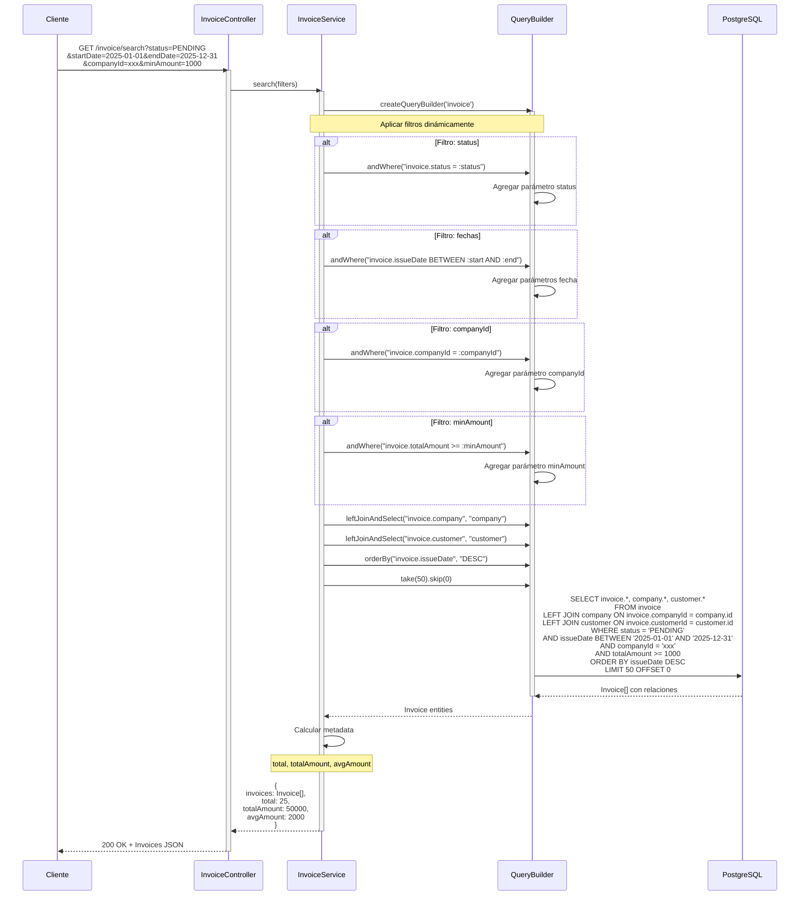
```mermaid
sequenceDiagram
    participant Client as Cliente
    participant Controller as InvoiceController
    participant Service as InvoiceService
    participant QB as QueryBuilder
    participant DB as PostgreSQL

    Client->>Controller: GET /invoice/search?status=PENDING<br/>&startDate=2025-01-01&endDate=2025-12-31<br/>&companyId=xxx&minAmount=1000
    activate Controller
    
    Controller->>Service: search(filters)
    activate Service
    
    Service->>QB: createQueryBuilder('invoice')
    activate QB
    
    Note over Service,QB: Aplicar filtros dinámicamente
    
    alt Filtro: status
        Service->>QB: andWhere("invoice.status = :status")
        QB->>QB: Agregar parámetro status
    end
    
    alt Filtro: fechas
        Service->>QB: andWhere("invoice.issueDate BETWEEN :start AND :end")
        QB->>QB: Agregar parámetros fecha
    end
    
    alt Filtro: companyId
        Service->>QB: andWhere("invoice.companyId = :companyId")
        QB->>QB: Agregar parámetro companyId
    end
    
    alt Filtro: minAmount
        Service->>QB: andWhere("invoice.totalAmount >= :minAmount")
        QB->>QB: Agregar parámetro minAmount
    end
    
    Service->>QB: leftJoinAndSelect("invoice.company", "company")
    Service->>QB: leftJoinAndSelect("invoice.customer", "customer")
    Service->>QB: orderBy("invoice.issueDate", "DESC")
    Service->>QB: take(50).skip(0)
    
    QB->>DB: SELECT invoice.*, company.*, customer.*<br/>FROM invoice<br/>LEFT JOIN company ON invoice.companyId = company.id<br/>LEFT JOIN customer ON invoice.customerId = customer.id<br/>WHERE status = 'PENDING'<br/>AND issueDate BETWEEN '2025-01-01' AND '2025-12-31'<br/>AND companyId = 'xxx'<br/>AND totalAmount >= 1000<br/>ORDER BY issueDate DESC<br/>LIMIT 50 OFFSET 0
    
    DB-->>QB: Invoice[] con relaciones
    deactivate QB
    
    QB-->>Service: Invoice entities
    
    Service->>Service: Calcular metadata
    Note over Service: total, totalAmount, avgAmount
    
    Service-->>Controller: {<br/>  invoices: Invoice[],<br/>  total: 25,<br/>  totalAmount: 50000,<br/>  avgAmount: 2000<br/>}
    deactivate Service
    
    Controller-->>Client: 200 OK + Invoices JSON
    deactivate Controller
```

---

### Generación de Estadísticas

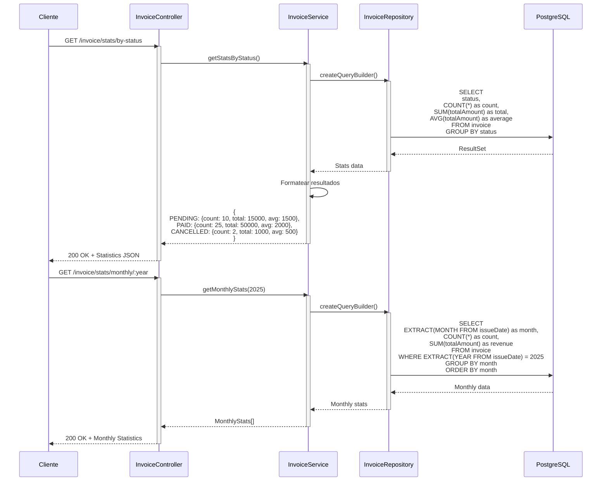
```mermaid
sequenceDiagram
    participant Client as Cliente
    participant Controller as InvoiceController
    participant Service as InvoiceService
    participant Repo as InvoiceRepository
    participant DB as PostgreSQL

    Client->>Controller: GET /invoice/stats/by-status
    activate Controller
    
    Controller->>Service: getStatsByStatus()
    activate Service
    
    Service->>Repo: createQueryBuilder()
    activate Repo
    
    Repo->>DB: SELECT<br/>  status,<br/>  COUNT(*) as count,<br/>  SUM(totalAmount) as total,<br/>  AVG(totalAmount) as average<br/>FROM invoice<br/>GROUP BY status
    
    DB-->>Repo: ResultSet
    Repo-->>Service: Stats data
    deactivate Repo
    
    Service->>Service: Formatear resultados
    
    Service-->>Controller: {<br/>  PENDING: {count: 10, total: 15000, avg: 1500},<br/>  PAID: {count: 25, total: 50000, avg: 2000},<br/>  CANCELLED: {count: 2, total: 1000, avg: 500}<br/>}
    deactivate Service
    
    Controller-->>Client: 200 OK + Statistics JSON
    deactivate Controller
    
    Client->>Controller: GET /invoice/stats/monthly/:year
    activate Controller
    
    Controller->>Service: getMonthlyStats(2025)
    activate Service
    
    Service->>Repo: createQueryBuilder()
    activate Repo
    
    Repo->>DB: SELECT<br/>  EXTRACT(MONTH FROM issueDate) as month,<br/>  COUNT(*) as count,<br/>  SUM(totalAmount) as revenue<br/>FROM invoice<br/>WHERE EXTRACT(YEAR FROM issueDate) = 2025<br/>GROUP BY month<br/>ORDER BY month
    
    DB-->>Repo: Monthly data
    Repo-->>Service: Monthly stats
    deactivate Repo
    
    Service-->>Controller: MonthlyStats[]
    deactivate Service
    
    Controller-->>Client: 200 OK + Monthly Statistics
    deactivate Controller
```

---

## 🎯 Convenciones de los Diagramas

### Participantes
- **Client**: Cliente HTTP (Browser, Postman, etc.)
- **Controller**: Capa de controladores NestJS
- **Service**: Capa de lógica de negocio
- **Repository**: Capa de acceso a datos (TypeORM)
- **DB**: Base de datos PostgreSQL
- **Validator**: class-validator para validaciones
- **BCrypt**: Librería de hash de contraseñas

### Notaciones
- `activate/deactivate`: Indica el tiempo de vida de una llamada
- `alt/else`: Flujos condicionales
- `loop`: Iteraciones
- `rect`: Agrupación lógica de operaciones
- `Note over`: Comentarios explicativos

### Códigos de Estado HTTP
- `200 OK`: Solicitud exitosa
- `201 Created`: Recurso creado exitosamente
- `400 Bad Request`: Error de validación o lógica
- `401 Unauthorized`: No autenticado
- `404 Not Found`: Recurso no encontrado
- `409 Conflict`: Conflicto (duplicado, etc.)

---

## 🔍 Cómo Visualizar estos Diagramas

### Opción 1: GitHub / GitLab
Los diagramas Mermaid se renderizan automáticamente.

### Opción 2: VS Code
Instala la extensión **Markdown Preview Mermaid Support**:
```bash
code --install-extension bierner.markdown-mermaid
```

### Opción 3: Mermaid Live Editor
Visita: https://mermaid.live/

### Opción 4: Herramientas de Documentación
- MkDocs con plugin mermaid2
- Docusaurus con soporte Mermaid
- GitBook con soporte Mermaid

---

**Generado:** 5 de Noviembre, 2025  
**Proyecto:** API-Factus  
**Versión:** 1.0.0  
**Arquitectura:** NestJS + TypeORM + PostgreSQL
